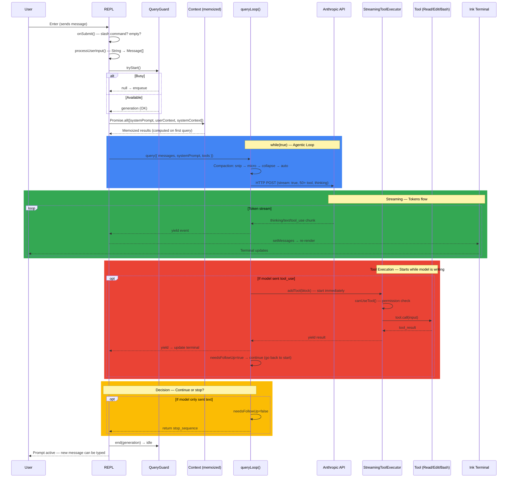

# Claude Code Workflow — Deep Source Code Analysis

A comprehensive, line-by-line technical analysis of [nirholas/claude-code](https://github.com/nirholas/claude-code) — the publicly available source code of Anthropic's Claude Code CLI. From the moment you type `claude` in your terminal to the final response — every function call, every design decision, every architectural pattern documented.




## What is this?

Claude Code is Anthropic's official CLI tool for interacting with Claude — a 512K+ line TypeScript codebase. This repository dissects its internals:

- **How does the agentic loop work?** — `while(true)` AsyncGenerator, not threads
- **How are tools executed in parallel?** — StreamingToolExecutor starts tools while the model is still writing
- **How does the model decide what to do?** — The model decides, not Claude Code (no if/else routing)
- **How are sub-agents isolated?** — Empty message history, filtered tools, optional git worktree
- **How is context managed across turns?** — 5-layer compaction pipeline (toolResultBudget → snip → microcompact → collapse → autocompact)

## Documents

| File | Language | Description |
|------|----------|-------------|
| [workflow_en.md](workflow_en.md) | English | Full technical workflow analysis |
| [workflow_tr.md](workflow_tr.md) | Turkish | Same content in Turkish (original) |

## What's Inside

### 15 Sections + Appendix

1. **Initialization** — Parallel prefetch, feature flags, REPL mount
2. **Query Flow** — Enter → message → QueryGuard → context → API → tool → loop
3. **Context Management** — 2-layer architecture, memoization, prompt caching
4. **Tool System** — 50+ tools, StreamingToolExecutor, partition strategy, 9+ layer permissions, Bash AST analysis
5. **Sub-agent System** — 3 modes (foreground/background/teammate), isolation wall, worktree
6. **Coordinator Mode** — Multi-worker orchestration, parallel task delegation
7. **Messages & Terminal Render** — 8 message types, Ink reconciler, ephemeral progress replace
8. **Hook System** — PreToolUse/PostToolUse/Stop hooks, input modification
9. **MCP** — Runtime tool discovery, JSON-RPC, 5 transport types
10. **Skill System** — SKILL.md format, inline vs fork execution
11. **Recovery** — 3 error recovery paths (prompt-too-long, max-tokens, fallback model)
12. **State Management** — DeepImmutable AppState, minimal store pattern
13. **Session Persistence** — JSONL transcript, resume mechanism
14. **QueryEngine** — SDK/headless mode (same query loop, no UI)
15. **Performance** — 9+ optimizations across startup, runtime, and memory

**Appendix:** Valuable source files ranked by importance with recommended reading order.

## Key Diagrams

The document includes mermaid diagrams for:

- End-to-end sequence diagram (color-coded: blue=loop, green=streaming, red=tool execution, yellow=decision)
- QueryGuard state machine
- Context architecture (system vs user context)
- Compaction pipeline effect (120K → 8K tokens)
- StreamingToolExecutor sequence (parallel/serial batching)
- Tool execution flowchart (runToolUse)
- Permission system flowchart (9+ layers)
- Sub-agent isolation architecture
- Coordinator mode sequence
- SendMessage routing
- Hook lifecycle
- Message growth diagram

## Quick Start: Understanding Claude Code

Read these 7 files from the [source](https://github.com/nirholas/claude-code/tree/main) in order:

```
1. src/query.ts                                 — How does the "heart" beat?
2. src/Tool.ts                                  — How are tools defined?
3. src/services/tools/StreamingToolExecutor.ts   — How does parallelism work?
4. src/context.ts                               — What does the model see?
5. src/tools/AgentTool/AgentTool.tsx            — How is a sub-agent created?
6. src/utils/QueryGuard.ts                      — How is concurrency managed?
7. src/hooks/useCanUseTool.tsx                  — How is security ensured?
```

These 7 files will give you 90% understanding of the 512K-line project.

## Core Design Decisions

| Decision | Description |
|----------|-------------|
| **Event-driven, no agent loop** | No background polling. Everything triggered by user action |
| **AsyncGenerator agentic loop** | `query()` is a `while(true)` generator — loops while tools exist, stops on text |
| **Streaming tool execution** | Tools start while model is still writing — no waiting |
| **Model decides** | Claude Code never says "call this tool" — the model decides autonomously |
| **Multi-layer permissions** | Rules + ML (auto) + hooks + AST + user approval |
| **Immutable state + React** | DeepImmutable AppState → useSyncExternalStore → Ink terminal |
| **5-layer context compaction** | toolResultBudget → snip → microcompact → collapse → autocompact |
| **Yield-based communication** | No callbacks or event bus — data flows through generator yields |
| **Skills: inline + fork** | Simple skills expand into prompt, heavy skills spawn isolated sub-agents |

## Disclaimer

This repository is an **independent technical analysis** only. We are not affiliated with, endorsed by, or connected to Anthropic in any way. All analysis is based solely on the publicly available source code at [github.com/nirholas/claude-code](https://github.com/nirholas/claude-code/tree/main). We do not distribute, modify, or redistribute any of the original source code. This is a read-only educational study of a publicly accessible codebase. All intellectual property rights for Claude Code belong to Anthropic. Any inaccuracies in this analysis are our own.

## License

This analysis document is provided as-is for educational purposes.
