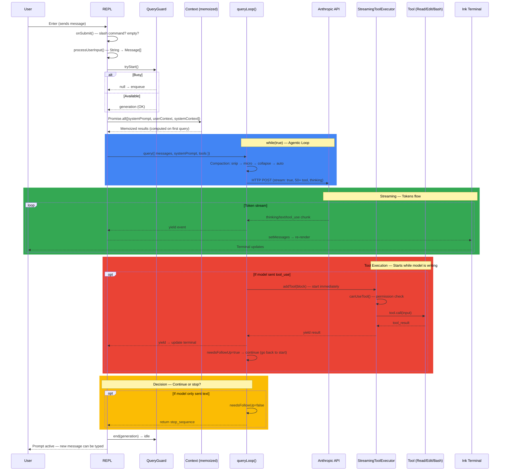
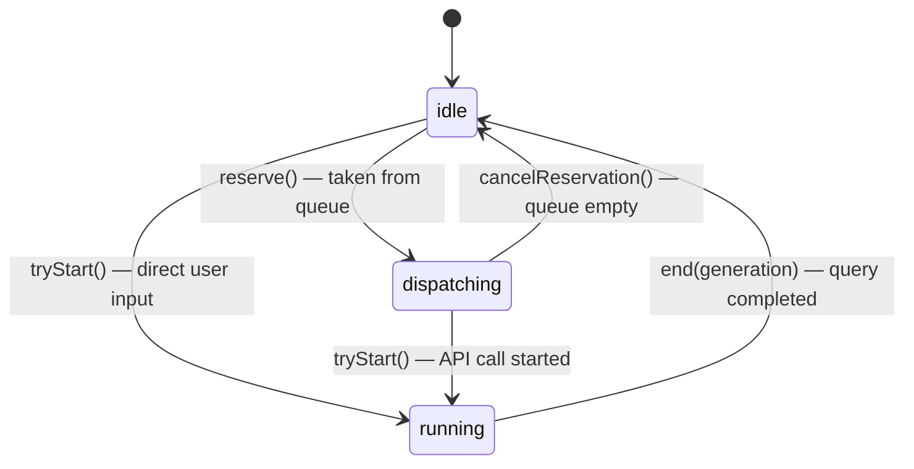
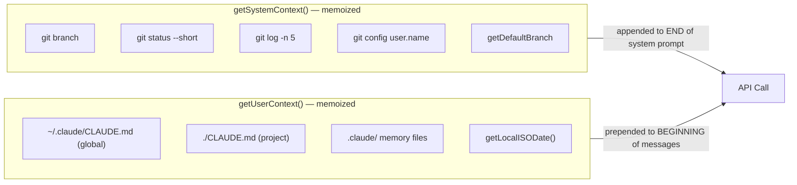
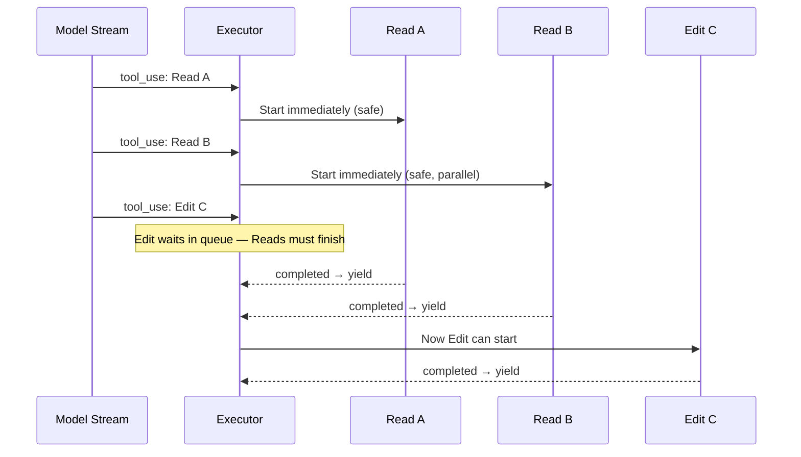
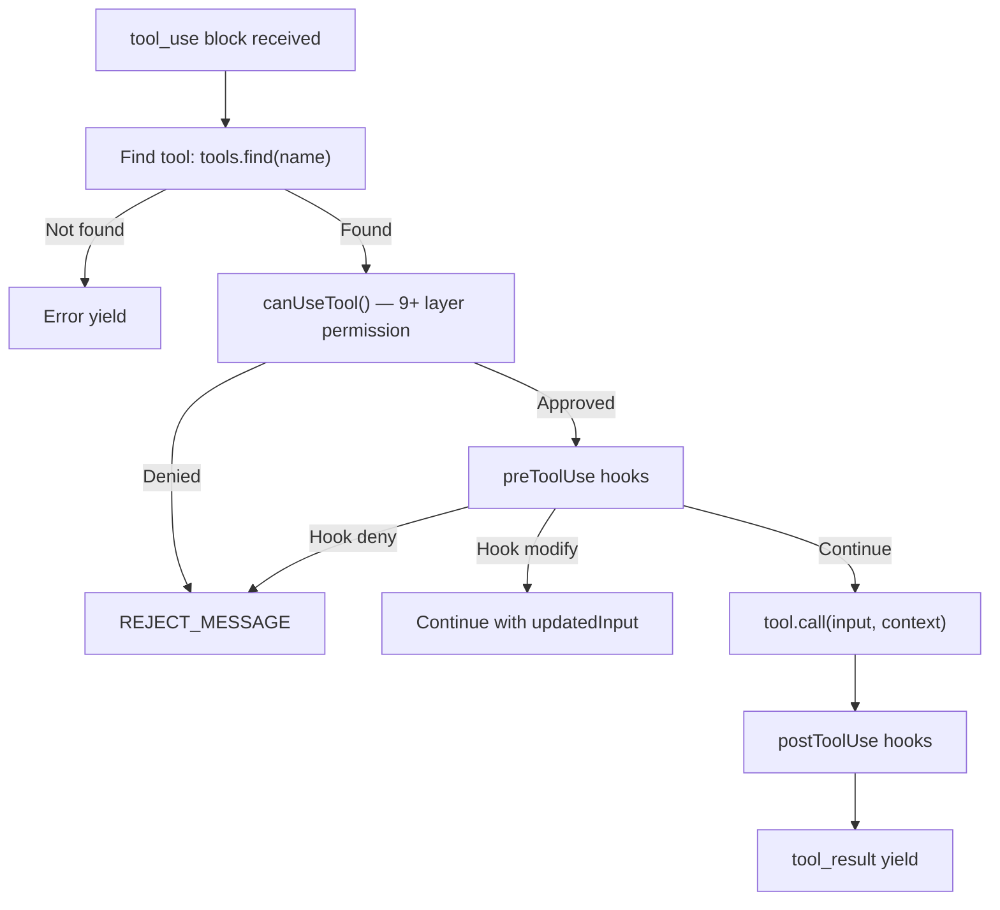
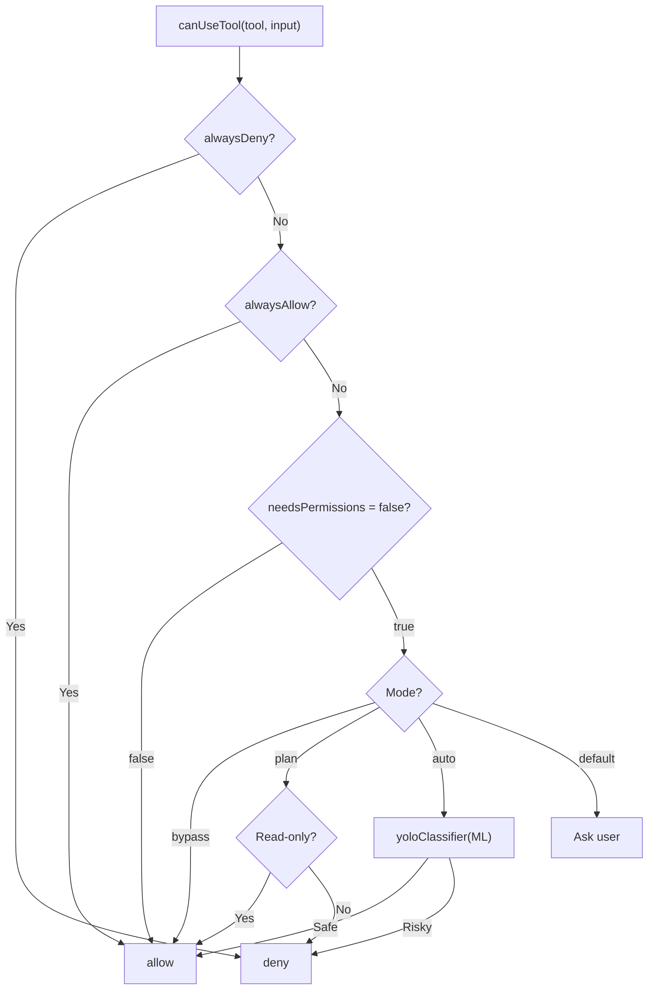
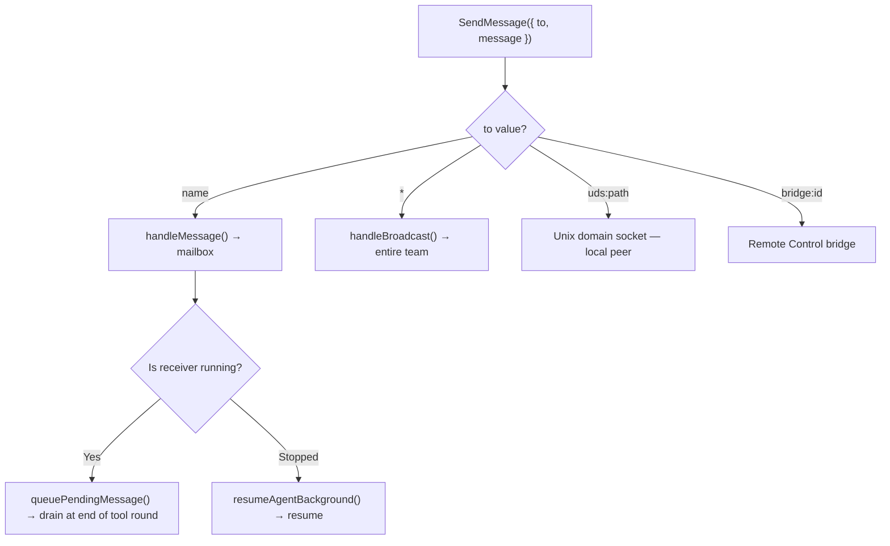
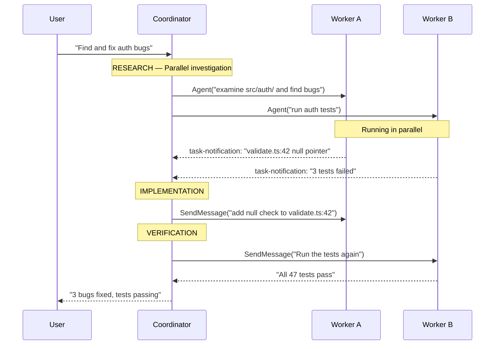

# Claude Code - Technical Workflow Diagram

This document was prepared by examining Anthropic's [Claude Code](https://github.com/nirholas/claude-code) open source code line by line. It explains step by step how Claude Code receives a user request, processes it, uses the AI model, and takes action on the local system.

**Source:** [github.com/nirholas/claude-code](https://github.com/nirholas/claude-code/tree/main) — The publicly available source code (mirror) of Anthropic's official CLI tool.

**Size:** ~1,900 files, 512,000+ lines of TypeScript. Runtime: Bun. UI: React + Ink.

---

## Table of Contents

- [General Overview — 4 Paragraph Summary](#general-overview--4-paragraph-summary)
- [Important Files and Functions](#important-files-and-functions)
- [1. Initialization](#1-initialization)
- [2. Query Flow: From Enter to Result](#2-query-flow-from-enter-to-result)
- [3. Context Management](#3-context-management)
- [4. Tool System](#4-tool-system)
- [5. Sub-agent System](#5-sub-agent-system)
- [6. Coordinator Mode](#6-coordinator-mode)
- [7. Message Structure and Terminal Rendering](#7-message-structure-and-terminal-rendering)
- [8. Hook System](#8-hook-system)
- [9. MCP (Model Context Protocol)](#9-mcp-model-context-protocol)
- [10. Skill System](#10-skill-system)
- [11. Recovery (Error Recovery)](#11-recovery-error-recovery)
- [12. State Management](#12-state-management)
- [13. Session Persistence](#13-session-persistence)
- [14. QueryEngine — SDK/Headless Mode](#14-queryengine--sdkheadless-mode)
- [15. Performance Optimizations](#15-performance-optimizations)
- [Conclusion: Core Design Decisions](#conclusion-core-design-decisions)
- [Appendix: Valuable Source Files](#appendix-valuable-source-files)

---

## General Overview — 4 Paragraph Summary

**Initialization:** When Claude Code is launched (`main.tsx`), it first starts parallel I/O (MDM settings + Keychain prefetch), then parses CLI arguments, registers 50+ tools and 100+ slash commands, determines the permission mode, and mounts the React/Ink render tree. From this point on, the system is entirely **event-driven** — there are no background loops running, and no processing occurs until the user presses Enter.

**Query:** When the user types a message and presses Enter, `onSubmit()` is triggered. The message is converted to `Message[]`, `QueryGuard` acquires a lock (preventing two queries from running simultaneously), contexts are loaded in parallel (git status + CLAUDE.md + system prompt — all memoized, computed once), and the `query()` AsyncGenerator starts. This generator is a `while(true)` loop: each iteration first performs context compaction (snip → microcompact → collapse → autocompact), then sends a streaming POST to the Anthropic API (`claude.ts:1822`). If the model response contains a `tool_use` block, `StreamingToolExecutor` immediately starts the tool **while the model is still writing**, the result is appended to `messages[]`, and the loop repeats. If the model returns only text, the loop ends.

**Subagent:** When the model calls `AgentTool`, an entirely new `QueryEngine` is created — with its own message history (starts empty), a filtered tool set (excluding Agent tool), a separate system prompt, and optional git worktree isolation. The sub-agent **does not see** the parent agent's conversation history. In foreground mode, the main loop waits; in background mode, it is registered in `AppState.tasks[]` and upon completion, a `<task_notification>` XML message is sent to the main thread. `SendMessageTool` enables inter-agent communication.

**Skill:** Skills are SKILL.md files (frontmatter + markdown). There are two operating modes: **inline** (default) — the skill content is expanded directly into the current prompt; **fork** (`context: fork`) — an isolated sub-agent is launched via `executeForkedSkill()`, the skill content becomes this sub-agent's prompt, and its tools are restricted via `allowed-tools`.

---

## Important Files and Functions

### Entry Points
| File | Purpose | Used In |
|------|---------|---------|
| `src/main.tsx` (~4700 lines) | Starts the application. Parallel prefetch, CLI parse, tool/command registration, REPL mount | Everything starts from here since application launch |
| `src/screens/REPL.tsx` (~5000 lines) | React/Ink terminal interface. `onSubmit`, `onQueryImpl`, `onQueryEvent` | Every user interaction passes through here |
| `src/QueryEngine.ts` | REPL-free operation for SDK/headless mode | Agent SDK, sub-agents, programmatic usage |

### Query Loop (Core)
| File | Function | Purpose | Used In |
|------|----------|---------|---------|
| `src/utils/handlePromptSubmit.ts` | `handlePromptSubmit()` :120 | Converts raw text to Message[], QueryGuard acquires lock | Called by `onSubmit()` |
| `src/utils/QueryGuard.ts` | `tryStart()`, `end()`, `reserve()` | 3-state state machine — only one query at a time | `handlePromptSubmit` + queue system |
| `src/query.ts` | `query()` :219, `queryLoop()` :241 | AsyncGenerator while(true) loop — the entire agentic loop | `onQueryImpl()` and `QueryEngine.submitMessage()` |

### API Layer
| File | Function | Purpose | Used In |
|------|----------|---------|---------|
| `src/services/api/claude.ts` | `queryModelWithStreaming()` :752 | Streaming wrapper — retry, fallback model switching | By `callModel()` |
| `src/services/api/claude.ts` | `anthropic.beta.messages.create()` :1822 | **HTTP POST** — the actual call to Anthropic API | The deepest point |

### Tool System
| File | Function | Purpose | Used In |
|------|----------|---------|---------|
| `src/services/tools/StreamingToolExecutor.ts` | `addTool()`, `executeTool()` | Starts the tool immediately while the model is streaming. 4 states: queued→executing→completed→yielded | Inside `queryLoop` |
| `src/services/tools/toolExecution.ts` | `runToolUse()` :337 | Permission check → hooks → tool.call() → result formatting | Inside `StreamingToolExecutor` |
| `src/hooks/useCanUseTool.tsx` | `canUseTool()` | 9+ layer permission check (deny/allow/hook/ML/sandbox/AST) | Before every tool |
| `src/services/tools/toolOrchestration.ts` | `partitionToolCalls()` | Splits tools into concurrent/serial groups | Tool execution |
| `src/Tool.ts` | `Tool` type, `ToolUseContext` | Tool interface + 50-field context | Every tool implements this |

### Context, Compaction, and State
| File | Function | Purpose | Used In |
|------|----------|---------|---------|
| `src/context.ts` | `getSystemContext()`, `getUserContext()` | Git status (5 parallel) + CLAUDE.md + date — memoized | At the start of every query |
| `src/utils/queryContext.ts` | `fetchSystemPromptParts()` :44 | Combines system prompt + context | `onQueryImpl` + `QueryEngine` |
| `src/services/compact/` | snip, microcompact, autocompact | 5-layer context compaction | Before each iteration of `queryLoop` |
| `src/state/AppStateStore.ts` | `AppState` type | 100+ field DeepImmutable central state | Entire application |
| `src/state/store.ts` | `createStore()`, `setState()` | Simple Redux-like store | State changes |

### Agent, Skill, Hook, MCP
| File | Function | Purpose | Used In |
|------|----------|---------|---------|
| `src/tools/AgentTool/AgentTool.tsx` | `call()` :239 | Sub-agent: sync/background/teammate | When model calls AgentTool |
| `src/tools/AgentTool/runAgent.ts` | `runAgent()` | New QueryEngine + filtered tools + query loop | Inside `AgentTool.call()` |
| `src/tools/SkillTool/SkillTool.ts` | `call()`, `executeForkedSkill()` | SKILL.md → inline or isolated sub-agent | When model calls SkillTool |
| `src/tools/SendMessageTool/` | `call()` | Inter-agent messaging (mailbox/broadcast/uds/bridge) | Coordinator + background |
| `src/utils/hooks.ts` | Hook system | PreToolUse/PostToolUse/PostSampling/Stop + input modification | Tool execution |
| `src/services/mcp/client.ts` | MCP client | Runtime tool discovery, JSON-RPC communication | Startup + tool execution |

---

## 1. Initialization

What happens first when you type `claude` in the terminal? The system does two things simultaneously: on one hand it starts reading API keys and MDM settings in the background, on the other hand it loads TypeScript modules. Thanks to this parallel approach, a ~230ms process is reduced to ~135ms. After modules are loaded, CLI arguments are parsed sequentially, 50+ tools and 100+ slash commands are registered, the permission mode is determined, and the React/Ink terminal interface is mounted. Finally, `QueryGuard` enters the idle position and the system completely stops — no background process runs until the user presses Enter.

### 1.1 Parallel Prefetch and Sequential Steps

```
1. main.tsx runs
     startMdmRawRead()          — Read MDM settings in parallel via subprocess
     startKeychainPrefetch()    — Read API keys from macOS Keychain in parallel

2. TypeScript imports are loaded over ~135ms
   (During this time MDM + Keychain results become ready)

3. Sequential startup steps:
     Commander.js CLI parse     — --model, --verbose, --permission-mode
     init()                     — telemetry, trust check
     loadPolicyLimits()         — org policies
     getInitialSettings()       — CLAUDE.md, settings.json
     initializeToolPermissionContext()  — determine permission mode
     getTools()                 — register 50+ tools
     getCommands()              — register 100+ slash commands
     fetchBootstrapData()       — API bootstrap
     initBundledSkills()        — Load skills

4. launchRepl()                — Mount React/Ink render tree
     renderAndRun()
       <AppStateProvider>
         <MailboxProvider>
           <REPL commands={...} tools={...} />

5. IDLE — Nothing is running
     QueryGuard._status = 'idle'
     screen = 'prompt'
     No processing occurs until the user presses Enter
```

### 1.2 Feature Flags

Bun's `feature()` function runs at compile time. If a flag returns `false`, all code behind that flag is physically stripped from the bundle — it is never loaded at runtime. This means features present in Anthropic's internal version (KAIROS, VOICE_MODE, BRIDGE_MODE, etc.) are not available in the public version. There are approximately 30 feature flags:

```typescript
const coordinatorModule = feature('COORDINATOR_MODE')
  ? require('./coordinator/coordinatorMode.js')
  : null;  // This branch is eliminated in external builds
```

---

## 2. Query Flow: From Enter to Result

This section is the heart of the entire system. What happens when a user types a message and presses Enter? In short: the message is structured, a lock is acquired, context is loaded, the model is called, if the model requests a tool the tool is executed and the result is appended to messages. If the model requests another tool, the loop cycles again; if it returns only text, the loop ends. All of this takes place inside an `AsyncGenerator` (`while(true)`) — there are no threads or processes, just a single coroutine.

### 2.1 Step by Step

```
STEP 1 — User presses Enter
  onSubmit()                                    src/screens/REPL.tsx:3142
  Purpose: Is it a slash command, empty, or normal? First filter.

STEP 2 — Convert raw text to message
  handlePromptSubmit()                          src/utils/handlePromptSubmit.ts:120
    processUserInput()                          src/utils/handlePromptSubmit.ts:396
  Purpose: String → Message[] (plain text, file attachment, IDE selection, bash mode)

STEP 3 — Acquire lock (prevent 2 queries at the same time)
  QueryGuard.tryStart()                         src/utils/QueryGuard.ts
  Purpose: idle → running transition. If busy, enqueue and wait.

STEP 4 — Load contexts in parallel (once, memoized)
  onQueryImpl()                                 src/screens/REPL.tsx:2661
    Promise.all([
      getSystemPrompt()                         src/utils/queryContext.ts:44
      getUserContext()                           src/context.ts         — CLAUDE.md + date
      getSystemContext()                         src/context.ts         — 5 git commands in parallel
    ])

STEP 5 — query() AsyncGenerator starts
  query()                                       src/query.ts:219
    queryLoop()                                 src/query.ts:241
  Purpose: while(true) loop. Control returns to REPL at each yield.

STEP 6a — Preprocessing: Context compaction (every iteration)
  applyToolResultBudget()                       — replace large results with disk references
  snipCompactIfNeeded()                         — trim old messages
  microcompact()                                — reduce 10K lines to 200 lines
  applyCollapsesIfNeeded()                      — collapse completed operations
  autocompact()                                 — summarize with LLM if token limit exceeded

STEP 6b — API call (streaming)
  deps.callModel()                              src/query.ts:659
    queryModelWithStreaming()                    src/services/api/claude.ts:752
      queryModel()                              src/services/api/claude.ts:1017
        anthropic.beta.messages.create({        src/services/api/claude.ts:1822  ← HTTP POST
          stream: true, model, messages,
          system, tools: [50+ tool], thinking
        })

STEP 6c — While stream arrives: Tool detection + execution
  If model writes text     → yield → REPL → print to terminal
  If model writes thinking → yield → "thinking..." display
  If model writes tool_use →
    needsFollowUp = true
    StreamingToolExecutor.addTool()              — TOOL STARTS WHILE MODEL IS STILL WRITING
      canUseTool()                               — 9+ layer permission
      tool.call()                                — ReadFile, Bash, Edit...

STEP 6d — Continue decision
  needsFollowUp = was there a tool_use?
    YES  → append tool results to messages[] → go back to start of while(true) → STEP 6a
    NO   → check stop hooks → return { reason: 'stop_sequence' }

STEP 7 — Cleanup
  QueryGuard.end(generation)                    → running → idle
  resetLoadingState()                           → spinner stops
  If there is a message in the queue → go to STEP 3
```

### 2.2 End-to-End Sequence Diagram

The following diagram shows the entire flow from the user pressing Enter to the result appearing in the terminal in a single picture:



### 2.3 Call Chain: From Enter to HTTP POST

```
onSubmit()                          REPL.tsx:3142
  └── handlePromptSubmit()          handlePromptSubmit.ts:120
        └── processUserInput()      → Create Message[]
        └── onQueryImpl()           REPL.tsx:2661
              ├── Promise.all([contexts])
              └── for await (event of query({...}))
                    └── queryLoop()           query.ts:241
                          └── deps.callModel()   query.ts:659
                                └── queryModelWithStreaming()   claude.ts:752
                                      └── queryModel()          claude.ts:1017
                                            └── anthropic.beta.messages.create()   claude.ts:1822
                                                ← HTTP POST
```

### 2.3 QueryGuard — Concurrency State Machine

Running two queries simultaneously is dangerous — both could try to modify the same file. QueryGuard is a simple state machine that prevents this. When the user sends a new message while a current query is running, the new message is queued and automatically started after the current query finishes. The generation number prevents cleanup code from stale (cancelled) queries from incorrectly closing the running query.



Generation number: Each `tryStart()` increments the generation. When `end(generation)` is called, if the generation is current, the lock is released; if a stale finally block arrives, it is ignored.

### 2.4 Actual Parameters Sent to the API

```typescript
{
  model: 'claude-sonnet-4-20250514',
  messages: [
    { role: 'user', content: '<current_date>2026-03-31</current_date>\n<claudeMd>...</claudeMd>\n\nfind the bugs in this file' }
  ],
  system: [
    { type: 'text', text: 'You are Claude Code, Anthropic\'s official CLI...' },
    { type: 'text', text: '# git_status\nCurrent branch: main\n...' }
  ],
  tools: [
    { name: 'Read', description: '...', input_schema: {...} },
    // ... 50+ tools
  ],
  stream: true,
  max_tokens: 16384,
  thinking: { type: 'adaptive' },
  temperature: 1,
}
```

### 2.5 Decision Point: Tool or Text?

This is the most critical architectural point. There is no if/else in Claude Code that says "call this tool in this situation." The system prompt presents the model with the names, descriptions, and JSON schemas of 50+ tools — like a restaurant menu. The model looks at the task and decides "I need Read for this job" and places a `tool_use` block in its response. Claude Code only checks whether this block exists or not.

**The model decides — not Claude Code.** It sees the tool definitions in the system prompt, places a tool_use block based on the task, or just writes text.

```typescript
// query.ts:829 — decision detection
if (msgToolUseBlocks.length > 0) {
  needsFollowUp = true;    // ← THIS FLAG CONTROLS THE LOOP
}
```

| stop_reason | Meaning | What happens |
|-------------|---------|--------------|
| `tool_use` | Model wants to call a tool | Execute tool → continue |
| `end_turn` | Model finished its work | Loop ends |
| `max_tokens` | Hit the token limit | Attempt recovery (3 times) |

### 2.6 How the Message Array Grows (Multi-Turn)

```
Turn 1:  [user("find bugs")]
  → API call → Model: tool_use Read("src/main.ts") → needsFollowUp=true

Turn 2:  [user, assistant(tool_use), user(tool_result: file)]
  → API call → Model: tool_use Grep("bug", "src/") → needsFollowUp=true

Turn 3:  [user, asst, result, asst(grep), result(grep)]
  → API call → Model: "I found 3 bugs: ..." (TEXT ONLY) → needsFollowUp=false → END
```

#### Message Growth Diagram

With each turn, `messages[]` grows. The model sees the ENTIRE history each time:

```
Turn 1: [ user ]                                              → 1 message
         ↓ needsFollowUp=true
Turn 2: [ user, assistant(tool_use), user(tool_result) ]       → 3 messages
         ↓ needsFollowUp=true
Turn 3: [ user, asst, result, asst(tool_use), result ]         → 5 messages
         ↓ needsFollowUp=false
Turn 4: [ user, asst, result, asst, result, asst(TEXT) ]       → 6 messages → END

Growth: ████░░░░░░  →  ████████░░  →  ████████████  →  compaction kicks in
```

---

## 3. Context Management

The model is fed two types of information on every API call: **system context** (git status, branch, recent commits) and **user context** (CLAUDE.md rules, today's date). This information does not change during the conversation — it is computed once on the first query and cached with `memoize`. This design both prevents unnecessary git command repetition and enables Anthropic's prompt caching feature (same prefix = lower cost).

An important distinction: user context is prepended to the **beginning** of messages (the model perceives this as "user instructions"), while system context is appended to the **end** of the system prompt (affects general behavior). Placing both in the same location would change the model's behavior.

### 3.1 Two-Layer Architecture



5 git commands run in parallel via `Promise.all`. Status is truncated if it exceeds 2000 characters.

### 3.2 fetchSystemPromptParts()

```
fetchSystemPromptParts({ tools, mainLoopModel, dirs, mcpClients, customSystemPrompt })
  │
  ├── IF customSystemPrompt EXISTS:
  │     getSystemPrompt() and getSystemContext() → SKIPPED
  │     getUserContext() → always runs
  │
  └── IF customSystemPrompt DOES NOT EXIST:
        getSystemPrompt()  → default system prompt (memoize)
        getSystemContext() → git status (memoize)
        getUserContext()   → CLAUDE.md + date (memoize)
```

The `customSystemPrompt` pattern is used in SubAgent and Skill execution — each sub-agent can receive a different system prompt.

### 3.3 Placement in API Call

```
system: [defaultSystemPrompt, appendSystemContext(systemContext)]
messages[0]: prependUserContext(userContext) + user question
```

These 3 parts also serve as the **prompt cache-key prefix** — memoize is important for this reason.

### 3.4 5-Layer Context Compaction

In long conversations, as message history grows, there is a risk of exceeding the token limit. To prevent this, messages are passed through a 5-layer pipeline before each API call. Each layer uses a different strategy — ordered from lightest to heaviest. Most of the time the first 2-3 layers are sufficient; autocompact (summarization with LLM) is the last resort that only kicks in when other layers are insufficient.

| Layer | Strategy | What It Does |
|-------|----------|--------------|
| **Tool Result Budget** | Size limit | Replaces large results with disk references |
| **Snip** | Time window | Deletes old messages, keeps the last N messages |
| **Microcompact** | Content shortening | Reduces 10K-line output to 200 lines |
| **Context Collapse** | Folding | Collapses completed operations |
| **Autocompact** | LLM summary | Summarizes entire history with an LLM call (last resort) |

#### Compaction Pipeline Effect

The following diagram shows how the message history shrinks at each layer after 20 turns:


In most conversations, the first 3-4 layers are sufficient. Autocompact only kicks in during very long conversations (50+ turns).

---

## 4. Tool System

Tools are Claude Code's "hands" — the model thinks, tools do the work. Each tool consists of a name, an input schema (JSON Schema validated with Zod), and a `call()` function. The moment the model sends a `tool_use` block in its response, `StreamingToolExecutor` starts that tool **immediately while the model is still writing** — it does not wait for the stream to finish. This approach saves significant time especially with multiple tool calls.

Tools are divided into two categories: **concurrent-safe** ones (read-only tools like Read, Glob, Grep) can run in parallel; **non-concurrent** ones (side-effectful tools like Edit, Bash) run alone and wait for all other tools to finish. Results are always yielded in API order — even if tool C finishes before tool A, A's result is returned first.

### 4.1 Tool Interface

```typescript
type Tool = {
  name: string;
  inputSchema: ZodSchema;           // Input validation
  isConcurrencySafe(input): boolean; // Can it run in parallel?
  isReadOnly(input): boolean;        // Has side effects?
  needsPermissions(input): boolean;  // Permission required?
  call(input, context): Promise<ToolResult>;
  maxResultSizeChars: number;
}

type ToolResult = {
  data: T,
  contextModifier?: (ctx) => ctx,    // Can modify context
  newMessages?: Message[],
}
```

### 4.2 50+ Tool Categories

| Category | Tools | Concurrency |
|----------|-------|-------------|
| **File Reading** | Read, Glob, Grep | Parallel |
| **File Writing** | Edit, Write | Serial |
| **System** | Bash, Sleep | Serial |
| **Web** | WebFetch, WebSearch | Parallel |
| **Agent** | Agent, SendMessage, TaskStop | Serial |
| **Code Intelligence** | LSP (goToDefinition, findReferences, hover, symbols) | Parallel |
| **MCP** | Dynamic (discovered at runtime) | Varies |
| **Other** | Skill, TodoWrite, NotebookEdit, AskUserQuestion, Cron | Varies |

### 4.3 StreamingToolExecutor

When a `tool_use` block arrives while the model is streaming, the tool is started **immediately** — it does not wait for the stream to finish.

```
Each tool goes through these states:
  queued → executing → completed → yielded
```

Decision algorithm (`canExecuteTool`):
```
Is there a running tool?
  NO → START this tool
  YES → Is this tool safe?
    NO → WAIT
    YES → Are ALL running tools safe?
      YES → START (parallel)
      NO → WAIT
```



Partition: Consecutive safe tools → same batch (parallel, max 10). Non-safe → its own batch (serial).

Sibling abort: If Bash errors, `siblingAbortController.abort()` → other tools are cancelled.

#### Tool Concurrency Timeline

Timing when the model returns 6 tools (parallel vs serial):

```
TIME   0ms      30ms     50ms     80ms     120ms    140ms 150ms
       ├────────┼────────┼────────┼────────┼────────┼─────┤
Glob   ████████████████████                                   safe, 50ms
Grep   ██████████████████████████████████                     safe, 80ms
Read   ██████████                                             safe, 30ms
       ├── Batch 1: parallel ─────────────┤
Edit                                       ████████████████   non-safe, 40ms
                                           ├ Batch 2: serial┤
Read2                                                        ████████  safe, 20ms
Read3                                                        ██████████ safe, 30ms
                                                             ├ Batch 3 ┤
Total: ~150ms   (serial would be: ~370ms → 60% savings)
```

### 4.4 Tool Call Execution: runToolUse()



### 4.5 Permission System: canUseTool — 9+ Layers

Every tool goes through a multi-layer permission check before execution. This check starts from top-level rules (alwaysDeny/alwaysAllow lists) and descends through the tool's own declaration (needsPermissions), the permission mode (bypass/plan/auto/default), ML-based classification (yoloClassifier), and finally asking the user. For the Bash tool, treeSitter AST analysis also comes into play. This layered approach provides security while allowing experienced users to skip unnecessary confirmations.



### 4.6 Bash Tool: treeSitter AST Analysis

Converts the command string into an actual syntax tree, not regex:

```
"cat /etc/passwd | sudo tee /tmp/out && rm -rf /"

treeSitter parse:
  Pipeline
    ├── Command: cat → Arg: /etc/passwd
    ├── Command: sudo → Command: tee → Arg: /tmp/out
    └── List (&&)
          └── Command: rm → Flag: -rf → Arg: /

5 analysis layers:
  1. Command name → on dangerous list? (rm, kill, dd, mkfs...)
  2. Flag → destructive? (-rf, --force, --no-preserve-root)
  3. Target path → outside sandbox? (/etc/, ../../)
  4. Pipe/redirect → dangerous? (| sudo, > /etc/, | sh, | curl)
  5. Subshell → hidden command? ($(rm -rf /), `backtick`)
```

Limitation: Runtime string concatenations like `eval "r"+"m -rf /"` cannot be caught.

---

## 5. Sub-agent System

Some tasks are too large for a single agent — like "analyze the entire project and fix bugs." In this case, the model calls `AgentTool` to create a new sub-agent. The sub-agent operates in a completely independent world: it has its own message history (starts empty), its own tool set (excluding Agent tool — to prevent recursion), and its own system prompt. It does not see the parent agent's conversation history — it only knows the prompt given to it.

There are three operating modes: **foreground** (main loop waits, receives result), **background** (main loop continues, XML notification arrives upon completion), and **teammate** (operates as a team member in coordinator mode). For background mode, progress is tracked via `AppState.tasks[]` — how many tools were executed, how many tokens were spent, what the last 5 activities were.

Optionally, each sub-agent can work in an isolated git worktree. This way it makes changes without affecting the main repo; when finished, if there are changes the branch name is returned, otherwise the worktree is deleted.

### 5.1 AgentTool.call() — 3 Paths

```
AgentTool.call({ prompt, run_in_background, team_name, isolation, model })
  │
  ├── Foreground (default)
  │     runAgent() → new QueryEngine
  │     Main loop WAITS → result returns as tool_result
  │
  ├── Background (run_in_background: true)
  │     registerAsyncAgent() → AppState.tasks[taskId]
  │     Main loop CONTINUES (does not wait)
  │     On completion → <task_notification> XML → notification to main thread
  │
  └── Teammate (team_name + name)
        spawnTeammate() → multi-agent team mode
```

#### Sub-agent Isolation Architecture

The sub-agent does not see the parent agent's history, permission state, or some of its tools:

```
PARENT AGENT                ISOLATION WALL                SUB-AGENT
─────────────               ────────────────              ─────────────
messages[50+]          ──X── not copied               ──►  messages[] = EMPTY
50+ tools (incl Agent) ──X── Agent removed            ──►  ~45 tools
System Prompt A        ──X── regenerated              ──►  System Prompt B
cwd: /project/         ──?── isolated if worktree     ──►  cwd: /tmp/wt-x/
MCP tools              ──✓── always passed            ──►  MCP tools
readFileState cache    ──✓── copy transferred         ──►  cache copy
```

### 5.2 runAgent() — A New World Is Built

```
1. Generate unique agentId
2. If isolation: 'worktree' → git worktree add /tmp/wt-{id}
3. filterToolsForAgent():
     Agent tool REMOVED (recursion prevention)
     MCP tools always pass
     Async agents get limited tool set (Read, Write, Edit, Bash, Glob, Grep, SendMessage)
4. fetchSystemPromptParts() — SEPARATE system prompt
5. Start agent-specific MCP servers
6. query() loop — completely independent while(true)
7. Sub-agent starts with EMPTY message history — DOES NOT SEE parent agent's history
8. On completion: close MCP, clean worktree, ProgressTracker reports
```

### 5.3 Background Task Tracking

```
AppState.tasks[taskId] = {
  type: 'local_agent',
  status: 'running',
  progress: { toolUseCount, inputTokens, outputTokens, recentActivities[5] },
  outputFile: '~/.claude/tasks/{taskId}/output.txt'
}
```

On completion, an XML notification is sent (appended to messages[] on the next model turn):

```xml
<task_notification>
  <task_id>agent-a1b</task_id>
  <status>completed</status>
  <result>Found 3 bugs...</result>
  <usage><total_tokens>12345</total_tokens><tool_uses>8</tool_uses></usage>
  <worktree><path>/tmp/wt-a1b</path><branch>fix/auth</branch></worktree>
</task_notification>
```

### 5.4 SendMessageTool — Agent Communication



### 5.5 Worktree Isolation

```
Main repo: /project/
Worker A: /tmp/worktree-a1b/     ← git worktree add (isolated copy)
Worker B: /tmp/worktree-c3d/     ← separate worktree

On completion:
  If changes exist → branch name returns to coordinator
  If no changes → worktree is deleted
```

---

## 6. Coordinator Mode

In normal mode, Claude works as a single agent — it reads files, edits them, and runs tests itself. In coordinator mode, Claude takes on the role of a **project manager**: it writes no code, instead it delegates tasks to worker agents. When told "find and fix auth bugs," the coordinator first sends parallel workers for research, synthesizes their results, assigns new workers for fixes, and finally has them verified. Each worker operates in its own isolated query loop — they do not affect each other. This approach provides dramatic speed gains especially for large, independent tasks.

The coordinator only sees 3 tools: `Agent` (create worker), `SendMessage` (send message), and `TaskStop` (stop). Workers have the normal tool set (Read, Edit, Bash, etc.) but cannot see the Agent tool — they cannot create other workers.

Activation condition: `feature('COORDINATOR_MODE') && CLAUDE_CODE_COORDINATOR_MODE=true`



Coordinator tool set: Agent, SendMessage, TaskStop. Worker tool set: Read, Edit, Bash, Glob, Grep (Agent EXCLUDED).

---

## 7. Message Structure and Terminal Rendering

All communication runs through messages. What the user types is `UserMessage`, the model's response is `AssistantMessage`, tool results are `tool_result` blocks — they are all appended to the same `messages[]` array and sent to the model on every API call. The model makes decisions by seeing all previous turns.

On the terminal side, the biggest challenge is performance: the model sends 20-30 tokens per second, and each token triggers a React re-render. Ink (React's terminal renderer) solves this by managing it like a DOM — instead of rewriting the entire screen, it only updates the changed lines. Tool progress messages have a special optimization: they replace the last message instead of appending, otherwise thousands of messages would accumulate and freeze the terminal.

### 7.1 Message Types

```typescript
type Message =
  | UserMessage           // User input
  | AssistantMessage      // Model response (thinking + text + tool_use)
  | SystemMessage         // System notification
  | ProgressMessage       // Tool progress (ephemeral — replaced)
  | AttachmentMessage     // File attachment
  | HookResultMessage     // Hook result
  | TombstoneMessage      // Deleted message marker
  | ToolUseSummaryMessage // Tool usage summary
```

### 7.2 AssistantMessage Blocks

```json
{
  "content": [
    { "type": "thinking", "thinking": "First I need to read the file..." },
    { "type": "text", "text": "I'm examining the file." },
    { "type": "tool_use", "id": "tool_1", "name": "Read", "input": {...} },
    { "type": "tool_use", "id": "tool_2", "name": "Grep", "input": {...} }
  ],
  "stop_reason": "tool_use"
}
```

Multiple `tool_use` blocks can come in the same response → all are started in parallel.

### 7.3 tool_result Format

```json
{
  "role": "user",
  "content": [
    { "type": "tool_result", "tool_use_id": "tool_1", "content": "file contents..." },
    { "type": "tool_result", "tool_use_id": "tool_2", "content": "search result..." }
  ]
}
```

If permission was denied: `is_error: true` + `"The user denied this tool call"`.

### 7.4 Terminal Render Optimization

**Ink Reconciler:** Manages terminal output like a DOM — computes diffs, only writes changed lines.

**Ephemeral Progress Replace:** Sleep/Bash sends 1+ progress updates per second. REPLACE the last message instead of pushing:
```typescript
if (isEphemeralToolProgress(newMessage)) {
  copy[copy.length - 1] = newMessage;  // replace, not append
}
// Otherwise 13,000+ messages, 120MB transcript, terminal freezes
```

**Yield Chain:** All communication is `yield`-based — no callbacks/event bus:
```
tool.call() → yield → query.ts → yield → REPL → setMessages → React re-render → Ink → Terminal
```

---

## 8. Hook System

Hooks are user-defined shell commands triggered at various points during tool execution. For example, a `PreToolUse` hook can perform a security check before every Bash tool execution; a `PostToolUse` hook can automatically run a linter after a file is edited. Hooks can not only allow/deny, but also **modify tool input** (via the `updatedInput` field) — for example, normalizing a file path. A special hook type, `Stop` hooks, run after the model stops and can say "no, continue" — causing the loop to automatically run one more iteration.


Defined in `settings.json`, executed as shell commands:

```json
{
  "hooks": {
    "PreToolUse": [{ "matcher": "BashTool", "command": "security-check $TOOL_INPUT" }],
    "PostToolUse": [{ "matcher": "FileEditTool", "command": "eslint --fix $TOOL_INPUT_FILE_PATH" }]
  }
}
```

Hook result: **allow** / **deny** / **modify** (input modification):

```typescript
{
  decision: 'allow',
  updatedInput?: { file_path: "/normalized/path" }  // Modify input
}
```

Stop hooks are special: They can say "continue" after the model stops → the loop restarts.

---

## 9. MCP (Model Context Protocol)

MCP is the protocol that allows Claude Code to use **external services** as tools in addition to its 45 built-in tools. For example, when a GitHub MCP server is connected, the model can see and use new tools like `mcp__github__create_issue`. The key difference: these tools are discovered not at compile time, but at **runtime**. When Claude Code starts, it reads the MCP server list from `settings.json`, opens a connection to each one, and asks via JSON-RPC what tools they offer. As a result, the model uses MCP tools as if they were built-in tools — there is no difference from the model's perspective. MCP tools are not exempt from the permission system (they go through the same `canUseTool` chain), but they receive special treatment in sub-agent filtering: tools with the `mcp__` prefix can **always** pass through.

### 9.1 Runtime Tool Discovery

Tools are discovered not at compile time, but at **runtime**:

```
settings.json → MCP server list
  → Open connection (stdio | sse | http | ws | sdk)
  → JSON-RPC: tools/list → ask the server for its tools
  → Convert to tool interface
  → Add to AppState.mcp.tools[] → model can see them
```

### 9.2 Execution Flow

```
Model: tool_use { name: "mcp__github__create_issue", input: {...} }
  → findMcpServerConnection() → server: "github", tool: "create_issue"
  → JSON-RPC: { method: "tools/call", params: { name, arguments } }
  → Server processes (GitHub API → create issue)
  → Result: returns to model as tool_result
```

MCP tools are not exempt from the permission system — they go through the same `canUseTool()` chain. However, they receive special treatment in sub-agent filtering: tools with the `mcp__` prefix can **always** pass through.

---

## 10. Skill System

Skills are markdown files that give Claude Code "expertise." A tool performs an atomic operation (read file, run bash), but a skill carries **procedural knowledge** — like "commit messages in this project follow this format" or "follow these steps when refactoring." Technically they consist of SKILL.md files, structured with YAML frontmatter, and operate in two modes: **inline** (skill content is added to the current prompt, no sub-agent is opened) and **fork** (an isolated sub-agent is launched, skill content becomes that agent's prompt). The file system is live-watched with Chokidar — if you change a skill file, it is automatically reloaded.

### 10.1 File Structure

```
~/.claude/skills/skill-name/SKILL.md    ← User skills
.claude/skills/skill-name/SKILL.md     ← Project skills
~/.claude/commands/name.md             ← Legacy format (still supported)
```

Chokidar file watcher monitors live → 300ms debounce on change → reload.

### 10.2 SKILL.md Frontmatter

```yaml
---
name: Display Name
description: What it does
allowed-tools: Read, Edit, Bash
arguments: [file_path, target]
model: sonnet                    # sonnet | opus | haiku | inherit
context: fork                    # fork → isolated sub-agent | absent → inline
user-invocable: true
effort: medium
when-to-use: "Use when refactoring is requested"
---

Skill content. $file_path → argument substitution.
${CLAUDE_SKILL_DIR} → skill directory.
! code blocks → executed as shell commands.
```

### 10.3 Two Operating Modes

**Inline (default):** Skill content is expanded directly into the current prompt. No sub-agent is opened. Processed via `processPromptSlashCommand()`. `return { status: 'inline' }`

**Fork (`context: fork`):** `executeForkedSkill()` → `runAgent()` → an isolated sub-agent is launched. Skill content becomes the sub-agent's prompt. Tool set is restricted via `allowed-tools`. `return { status: 'forked', agentId }`

---

## 11. Recovery (Error Recovery)

API calls don't always succeed. If the message history is too large, a `prompt-too-long` error occurs; if the model writes too much, it gets cut off with `max-output-tokens`; if the server is busy, a `429/529` error is returned. Claude Code applies a different recovery strategy for each of these errors — and most of them happen behind the scenes without showing anything to the user. There are three different recovery paths, all of which restart the loop with `continue` inside `queryLoop`:

### 11.1 3 Recovery Paths Inside queryLoop

```
API error received →
  │
  ├── prompt-too-long
  │     If not attempted → reactiveCompact() → continue
  │     If already attempted → return (terminal)
  │
  ├── max-output-tokens
  │     < 3 attempts → recovery count++ → append truncated part → continue
  │     ≥ 3 → increase maxOutputTokensOverride → if still failing → terminal
  │
  └── FallbackTriggeredError (overloaded)
        If fallbackModel exists → switch model → discard tools → continue
        Otherwise → throw
```

### 11.2 API Retry

```
429/529/overloaded → backoff wait → 3 attempts
Failed → FallbackTriggeredError → queryLoop catches it
```

---

## 12. State Management

The entire application state is held in a single `AppState` object — which model is being used, what the permission mode is, which MCP servers are connected, which agents are running in the background, what state the plugins are in. This object is wrapped with `DeepImmutable`: no field can be directly modified. To update state, `setState(prev => ({...prev, changes}))` is called and a new immutable copy is created. Each change is notified to listeners registered via `subscribe()`. On the React side, it connects via `useSyncExternalStore` — when state changes, the relevant components automatically re-render. Similar to Redux but without reducers, actions, or middleware — much simpler.

```typescript
type AppState = DeepImmutable<{
  settings, verbose, mainLoopModel,
  toolPermissionContext,              // 11 fields
  tasks: Record<string, TaskState>,   // Background agents
  mcp: { clients, tools },
  plugins: { loaded, errors },
  speculationState,
  // ... 100+ fields total
}>
```

Store pattern — Redux-like but without reducers/middleware:

```typescript
createStore(initialState, onChange) → {
  getState(): AppState,
  setState(updater): void,
  subscribe(listener): () => void,
}
```

State → `useSyncExternalStore` → React re-render → Ink reconciler → Terminal.

---

## 13. Session Persistence

Each conversation is saved with a unique UUID to the `~/.claude/sessions/` directory. Each message (user input, model response, tool result) is written as a separate line in JSONL (JSON Lines) format. This way, even if the conversation closes, it can be resumed from where it left off with `--resume` — messages are read from disk, loaded into the `messages[]` array, and the model continues seeing all previous context.

```
~/.claude/sessions/{uuid}.jsonl     — JSONL transcript (each message on one line)
~/.claude/sessions/{uuid}.meta.json — title, model, date, token usage
```

Resume: `claude --resume {session_id}` or `--continue` (most recent session).

---

## 14. QueryEngine — SDK/Headless Mode

Claude Code has two operating modes: interactive (REPL — terminal interface) and programmatic (QueryEngine — SDK). Both use the same `query()` function — the only difference is UI and permission management. Sub-agents also run via QueryEngine: `AgentTool` creates a new QueryEngine and runs its own loop without a REPL. Thanks to this approach, agent loop code is written in one place but can be used in terminal, SDK, and sub-agent modes.

| | REPL | QueryEngine |
|---|---|---|
| UI | React/Ink terminal | None |
| Permission | PermissionRequest component | Constructor callback |
| State | AppStateProvider (React Context) | Class fields |
| Usage | `claude` CLI | SDK, sub-agents |

---

## 15. Performance Optimizations

| Category | Optimization | Impact |
|----------|-------------|--------|
| Startup | Parallel prefetch (MDM, Keychain) | ~95ms savings |
| Startup | Feature flag dead code elimination | Bundle minimized |
| Runtime | Streaming tool execution | Tool starts while model writes |
| Runtime | Concurrent tool batching (max 10) | Read/Glob/Grep in parallel |
| Runtime | Ephemeral progress replace | 13K messages → single message |
| Runtime | Memoized context | Git command runs only once |
| Memory | 5-layer compaction | Token limit never exceeded |
| Memory | Content replacement (disk ref) | Large results not held in memory |
| Memory | FileStateCache (LRU) | File state in bounded memory |

---

## Conclusion: Core Design Decisions

| Decision | Explanation |
|----------|-------------|
| **Event-driven, not agent loop** | No background loop running. Everything is triggered by user action |
| **Agentic loop via AsyncGenerator** | `query()` is a `while(true)` generator — loops when tools exist, stops otherwise |
| **Streaming tool execution** | Tools start immediately while model writes — no waiting |
| **Model decides** | Claude Code never says "call a tool" — the model decides on its own |
| **Multi-layer permission system** | Rules + ML (auto) + hooks + AST + user confirmation |
| **Immutable state + React** | DeepImmutable AppState → useSyncExternalStore → Ink terminal |
| **5-layer context compaction** | toolResultBudget → snip → microcompact → collapse → autocompact |
| **Yield-based communication** | No callback/event bus — data flows via generator yield |
| **Skill: inline + fork** | Simple skills expand into prompt, heavy skills get isolated sub-agent |

---

## Appendix: Valuable Source Files

For those who want to read the source code, the most instructive files in order of importance. All files are in the [github.com/nirholas/claude-code](https://github.com/nirholas/claude-code/tree/main) repo:

### Must Read (Core Flow)

| File | Lines | Why It's Valuable |
|------|-------|-------------------|
| `src/query.ts` | ~1200 | **The heart of the entire system.** The `queryLoop()` while(true) loop, compaction, API call, tool detection, continue decision — everything is here. If you understand this file, you understand the entire system. |
| `src/services/tools/StreamingToolExecutor.ts` | ~530 | **Parallel tool execution engine.** `addTool()`, `canExecuteTool()`, `processQueue()` — shows how tools are started immediately while the model writes. Concurrency logic lives here. |
| `src/Tool.ts` | ~700 | **Tool interface and ToolUseContext definition.** Shows what every tool must conform to and how the 50+ field context is structured. |
| `src/services/tools/toolExecution.ts` | ~490 | **Tool execution pipeline.** `runToolUse()`: permission check → hook → call → result formatting. Shows how a single tool_use block is processed from start to finish. |

### Very Valuable (Understanding the Architecture)

| File | Lines | Why It's Valuable |
|------|-------|-------------------|
| `src/screens/REPL.tsx` | ~5000 | **Terminal interface.** `onSubmit()`, `onQueryImpl()`, `onQueryEvent()` — the entry point of user interaction. Large file but key functions are at specific lines. |
| `src/tools/AgentTool/AgentTool.tsx` | ~450 | **Sub-agent creation.** 3 paths (foreground/background/teammate), isolation logic, worktree creation decision. |
| `src/tools/AgentTool/runAgent.ts` | ~250 | **What happens inside a sub-agent.** Tool filtering, new QueryEngine, starting an independent query loop. |
| `src/context.ts` | ~200 | **Context gathering.** 5 parallel git commands, CLAUDE.md loading, memoize pattern. Short and easy to read. |
| `src/utils/queryContext.ts` | ~100 | **fetchSystemPromptParts().** How the system prompt is assembled, customSystemPrompt bypass logic. |
| `src/services/api/claude.ts` | ~2000 | **API layer.** `queryModelWithStreaming()` retry/fallback, `queryModel()` parameter preparation, actual HTTP POST at line 1822. |
| `src/hooks/useCanUseTool.tsx` | ~300 | **Permission system.** 9+ layer decision chain, yoloClassifier integration. |

### Interesting Reads (Special Patterns)

| File | Lines | Why It's Valuable |
|------|-------|-------------------|
| `src/utils/QueryGuard.ts` | ~80 | **State machine example.** 3 states, stale cleanup prevention via generation number. Very short, very clean. |
| `src/services/tools/toolOrchestration.ts` | ~100 | **Partition algorithm.** How consecutive safe tools are grouped. Short and understandable. |
| `src/utils/bash/treeSitterAnalysis.ts` | ~400 | **Bash security analysis.** Converting command strings to AST, dangerous pattern detection. |
| `src/tools/SkillTool/SkillTool.ts` | ~700 | **Skill execution.** Inline vs fork decision, frontmatter parsing, argument substitution. |
| `src/skills/loadSkillsDir.ts` | ~480 | **Skill loading.** Chokidar file watching, YAML frontmatter parsing, deduplication. |
| `src/services/mcp/client.ts` | ~3300 | **MCP integration.** Runtime tool discovery, JSON-RPC, 5 transport types. Large but the sole resource for understanding MCP. |
| `src/tasks/LocalAgentTask/LocalAgentTask.tsx` | ~260 | **Background task management.** ProgressTracker, task-notification XML, task lifecycle. |
| `src/tools/SendMessageTool/SendMessageTool.ts` | ~800 | **Agent communication.** 4 routing modes (mailbox/broadcast/uds/bridge), pending message drain. |
| `src/state/store.ts` | ~60 | **Minimal store pattern.** createStore, setState, subscribe — a Redux alternative in 60 lines. |
| `src/services/PromptSuggestion/speculation.ts` | ~740 | **Speculation engine.** Overlay directory creation, copy-on-write, approve/reject flow. |
| `src/tools/LSPTool/LSPTool.ts` | ~250 | **Code intelligence.** goToDefinition, findReferences, hover — 9 LSP operations. |

### Reading Recommendation

The recommended reading order to understand the system:

```
1. src/query.ts                          — How does the "heart" beat?
2. src/Tool.ts                           — How are tools defined?
3. src/services/tools/StreamingToolExecutor.ts  — How does parallelism work?
4. src/context.ts                        — What does the model see?
5. src/tools/AgentTool/AgentTool.tsx     — How is a sub-agent created?
6. src/utils/QueryGuard.ts              — How is concurrency managed?
7. src/hooks/useCanUseTool.tsx           — How is security ensured?
```

Read these 7 files in order and you'll understand 90% of the 512K-line project.

If you read these 7 files in order, you'll understand 90% of the 512K-line project.
