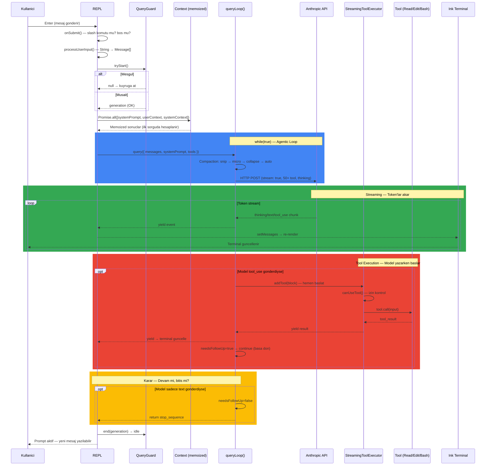
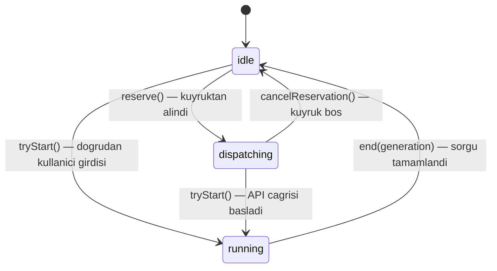
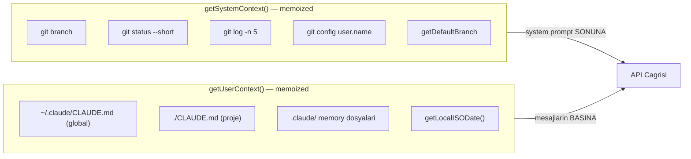
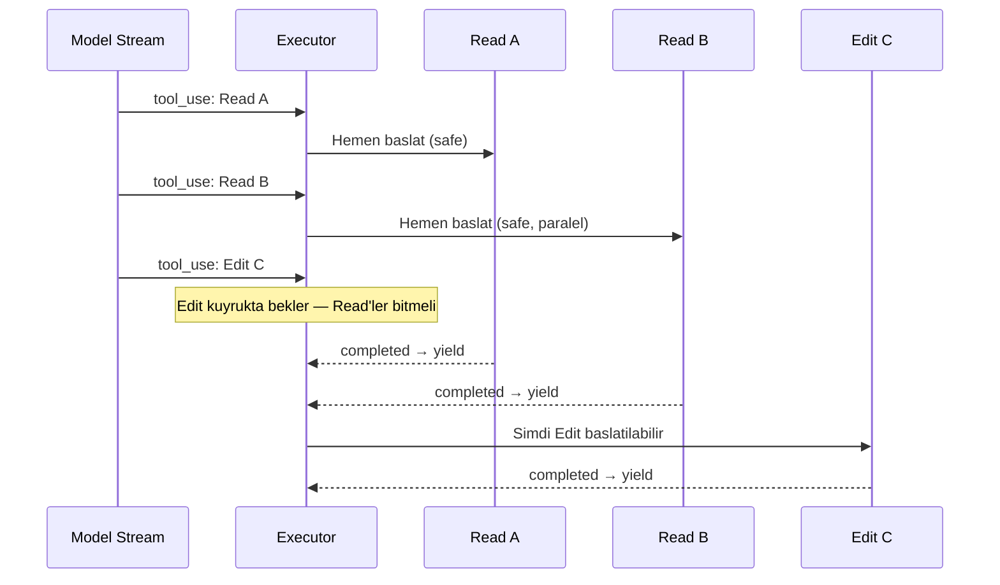
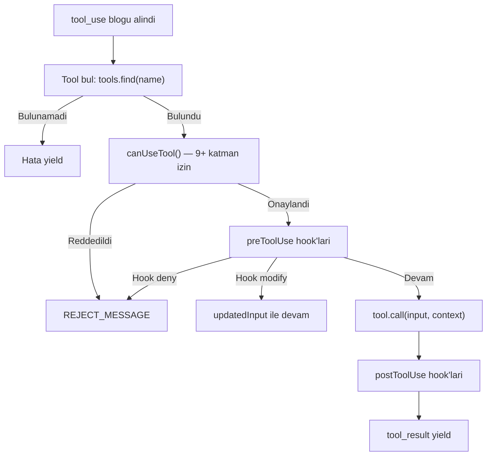
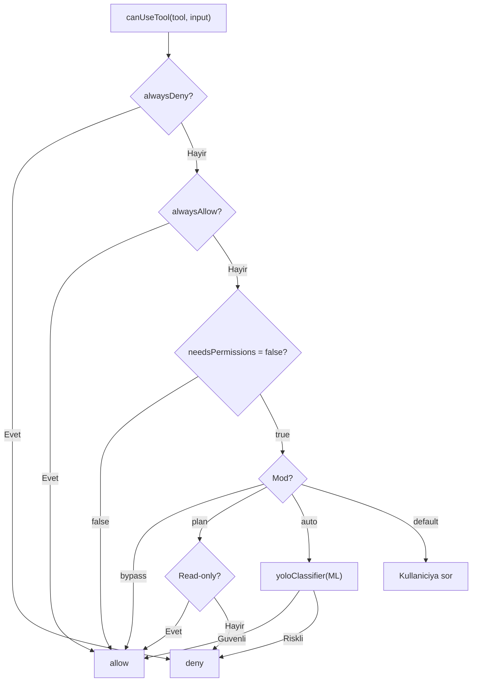
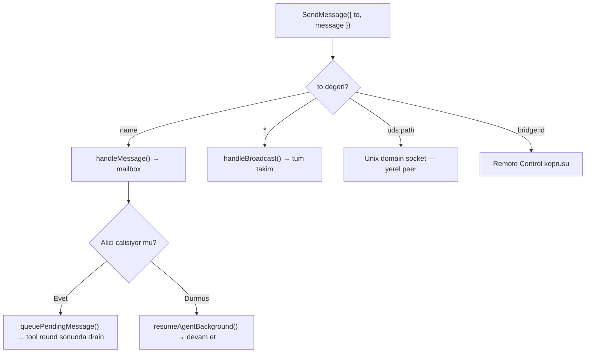
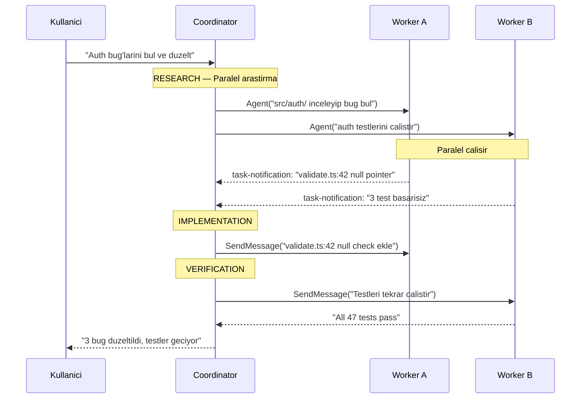
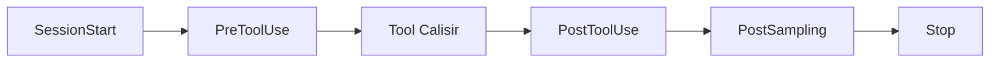

# Claude Code - Teknik Isleyis Akis Semasi (Workflow)

Bu dokuman, Anthropic'in [Claude Code](https://github.com/nirholas/claude-code) acik kaynak kodunu satir satir inceleyerek hazirlanmistir. Claude Code'un bir kullanici istegini alip nasil isledigini, AI modelini nasil kullandigini ve yerel sistemde nasil eyleme gectigini adim adim aciklar.

**Kaynak:** [github.com/nirholas/claude-code](https://github.com/nirholas/claude-code/tree/main) — Anthropic'in resmi CLI aracinin halka acik kaynak kodu (mirror).

**Boyut:** ~1,900 dosya, 512,000+ satir TypeScript. Runtime: Bun. UI: React + Ink.

---

## Icerik

- [Genel Isleyis — 4 Paragraf Ozet](#genel-isleyis--4-paragraf-ozet)
- [Onemli Dosyalar ve Fonksiyonlar](#onemli-dosyalar-ve-fonksiyonlar)
- [1. Baslangic (Initialization)](#1-baslangic-initialization)
- [2. Query Akisi: Enter'dan Sonuca](#2-query-akisi-enterdan-sonuca)
- [3. Context Yonetimi](#3-context-yonetimi)
- [4. Tool Sistemi](#4-tool-sistemi)
- [5. Alt-Ajan (Subagent) Sistemi](#5-alt-ajan-subagent-sistemi)
- [6. Coordinator Mode](#6-coordinator-mode)
- [7. Mesaj Yapisi ve Terminal Render](#7-mesaj-yapisi-ve-terminal-render)
- [8. Hook Sistemi](#8-hook-sistemi)
- [9. MCP (Model Context Protocol)](#9-mcp-model-context-protocol)
- [10. Skill Sistemi](#10-skill-sistemi)
- [11. Recovery (Hata Kurtarma)](#11-recovery-hata-kurtarma)
- [12. State Yonetimi](#12-state-yonetimi)
- [13. Session Persistence](#13-session-persistence)
- [14. QueryEngine — SDK/Headless Mod](#14-queryengine--sdkheadless-mod)
- [15. Performans Optimizasyonlari](#15-performans-optimizasyonlari)
- [Sonuc: Temel Tasarim Kararlari](#sonuc-temel-tasarim-kararlari)
- [Ek: Degerli Kaynak Dosyalar](#ek-degerli-kaynak-dosyalar)

---

## Genel Isleyis — 4 Paragraf Ozet

**Baslangic:** Claude Code calistirildiginda (`main.tsx`) once paralel I/O baslatir (MDM ayarlari + Keychain prefetch), ardindan CLI argumanlari parse eder, 50+ tool ve 100+ slash komutu register eder, izin modunu belirler ve React/Ink render agacini mount eder. Bu noktadan sonra sistem tamamen **event-driven**'dir — arka planda donen hicbir dongu yoktur, kullanici Enter'a basana kadar hicbir islem yapilmaz.

**Query:** Kullanici mesaj yazip Enter'a bastiginda `onSubmit()` tetiklenir. Mesaj `Message[]`'e donusturulur, `QueryGuard` kilit alir (ayni anda iki sorgu olmasini onler), context'ler paralel yuklenir (git status + CLAUDE.md + sistem promptu — hepsi memoized, bir kez hesaplanir) ve `query()` AsyncGenerator'i baslar. Bu generator bir `while(true)` dongusudur: her turda once context sikistirma yapilir (snip → microcompact → collapse → autocompact), sonra Anthropic API'ye streaming POST atilir (`claude.ts:1822`). Model yanitinda `tool_use` blogu varsa `StreamingToolExecutor` tool'u **model hala yazarken** hemen baslatir, sonuc `messages[]`'e eklenir ve dongu tekrarlanir. Model sadece text dondururse dongu biter.

**Subagent:** Model `AgentTool`'u cagirdiginda tamamen yeni bir `QueryEngine` olusturulur — kendi mesaj gecmisi (bos baslar), filtrelenmis tool seti (Agent tool haric), ayri sistem promptu ve opsiyonel git worktree izolasyonu ile. Alt-ajan ust ajanin konusma gecmisini **gormez**. Foreground modda ana dongu bekler; background modda `AppState.tasks[]`'e kaydedilir ve tamamlaninca `<task_notification>` XML mesaji olarak ana thread'e bildirilir. `SendMessageTool` ile agent'lar arasi iletisim saglanir.

**Skill:** Skill'ler SKILL.md dosyalaridir (frontmatter + markdown). Iki calisma modu vardir: **inline** (varsayilan) — skill icerigi dogrudan mevcut prompt'a genisletilir; **fork** (`context: fork`) — `executeForkedSkill()` ile izole bir sub-agent baslatilir, skill icerigi bu sub-agent'in promptu olur, `allowed-tools` ile tool'lari sinirlanir.

---

## Onemli Dosyalar ve Fonksiyonlar

### Giris Noktalari
| Dosya | Gorevi | Nerede Kullanilir |
|-------|--------|-------------------|
| `src/main.tsx` (~4700 satir) | Uygulamayi baslatir. Paralel prefetch, CLI parse, tool/komut register, REPL mount | Uygulama baslangicindan itibaren her sey buradan baslar |
| `src/screens/REPL.tsx` (~5000 satir) | React/Ink terminal arayuzu. `onSubmit`, `onQueryImpl`, `onQueryEvent` | Kullanicinin her etklesimi buradan gecer |
| `src/QueryEngine.ts` | SDK/headless mod icin REPL'siz calisma | Agent SDK, sub-agent'lar, programatik kullanim |

### Query Dongusu (Cekirdek)
| Dosya | Fonksiyon | Gorevi | Nerede Kullanilir |
|-------|-----------|--------|-------------------|
| `src/utils/handlePromptSubmit.ts` | `handlePromptSubmit()` :120 | Ham metni Message[]'e donusturur, QueryGuard kilit alir | `onSubmit()` tarafindan cagrilir |
| `src/utils/QueryGuard.ts` | `tryStart()`, `end()`, `reserve()` | 3 durumlu state machine — ayni anda tek sorgu | `handlePromptSubmit` + kuyruk sistemi |
| `src/query.ts` | `query()` :219, `queryLoop()` :241 | AsyncGenerator while(true) dongusu — tum agentic loop | `onQueryImpl()` ve `QueryEngine.submitMessage()` |

### API Katmani
| Dosya | Fonksiyon | Gorevi | Nerede Kullanilir |
|-------|-----------|--------|-------------------|
| `src/services/api/claude.ts` | `queryModelWithStreaming()` :752 | Streaming sarmalayici — retry, fallback model gecisi | `callModel()` tarafindan |
| `src/services/api/claude.ts` | `anthropic.beta.messages.create()` :1822 | **HTTP POST** — Anthropic API'ye gercek cagri | En dip nokta |

### Tool Sistemi
| Dosya | Fonksiyon | Gorevi | Nerede Kullanilir |
|-------|-----------|--------|-------------------|
| `src/services/tools/StreamingToolExecutor.ts` | `addTool()`, `executeTool()` | Model stream ederken tool'u hemen baslatir. 4 durum: queued→executing→completed→yielded | `queryLoop` icinde |
| `src/services/tools/toolExecution.ts` | `runToolUse()` :337 | Izin kontrol → hook'lar → tool.call() → sonuc format | `StreamingToolExecutor` icinde |
| `src/hooks/useCanUseTool.tsx` | `canUseTool()` | 9+ katman izin kontrolu (deny/allow/hook/ML/sandbox/AST) | Her tool oncesinde |
| `src/services/tools/toolOrchestration.ts` | `partitionToolCalls()` | Tool'lari concurrent/serial gruplara ayirir | Tool calistirma |
| `src/Tool.ts` | `Tool` type, `ToolUseContext` | Tool arayuzu + 50 alanli context | Her tool implemente eder |

### Context, Sikistirma ve State
| Dosya | Fonksiyon | Gorevi | Nerede Kullanilir |
|-------|-----------|--------|-------------------|
| `src/context.ts` | `getSystemContext()`, `getUserContext()` | Git status (5 paralel) + CLAUDE.md + tarih — memoized | Her query basinda |
| `src/utils/queryContext.ts` | `fetchSystemPromptParts()` :44 | Sistem promptu + context birlestirir | `onQueryImpl` + `QueryEngine` |
| `src/services/compact/` | snip, microcompact, autocompact | 5 katmanli context sikistirma | `queryLoop` her tur oncesi |
| `src/state/AppStateStore.ts` | `AppState` type | 100+ alanli DeepImmutable merkezi durum | Tum uygulama |
| `src/state/store.ts` | `createStore()`, `setState()` | Redux benzeri basit store | State degisikligi |

### Agent, Skill, Hook, MCP
| Dosya | Fonksiyon | Gorevi | Nerede Kullanilir |
|-------|-----------|--------|-------------------|
| `src/tools/AgentTool/AgentTool.tsx` | `call()` :239 | Sub-agent: sync/background/teammate | Model AgentTool cagirdiginda |
| `src/tools/AgentTool/runAgent.ts` | `runAgent()` | Yeni QueryEngine + filtrelenmis tool + query loop | `AgentTool.call()` icinde |
| `src/tools/SkillTool/SkillTool.ts` | `call()`, `executeForkedSkill()` | SKILL.md → inline veya izole sub-agent | Model SkillTool cagirdiginda |
| `src/tools/SendMessageTool/` | `call()` | Agent'lar arasi mesaj (mailbox/broadcast/uds/bridge) | Coordinator + background |
| `src/utils/hooks.ts` | Hook sistemi | PreToolUse/PostToolUse/PostSampling/Stop + input modifikasyonu | Tool calistirma |
| `src/services/mcp/client.ts` | MCP istemci | Runtime tool discovery, JSON-RPC iletisim | Baslangic + tool calistirma |

---

## 1. Baslangic (Initialization)

Terminalde `claude` yazildiginda ilk ne olur? Sistem iki seyi ayni anda yapar: bir yandan API anahtarlarini ve MDM ayarlarini arka planda okumaya baslar, diger yandan TypeScript modullerini yukler. Bu paralel yaklasim sayesinde ~230ms surecek islem ~135ms'e duser. Moduller yuklendikten sonra sirayla CLI argumanlari parse edilir, 50+ tool ve 100+ slash komutu register edilir, izin modu belirlenir ve React/Ink terminal arayuzu mount edilir. En son `QueryGuard` idle konumuna gecer ve sistem tamamen durur — kullanici Enter'a basana kadar hicbir arka plan islemi calismaz.

### 1.1 Paralel Prefetch ve Sirali Adimlar

```
1. main.tsx calisir
     startMdmRawRead()          — MDM ayarlarini subprocess ile paralel oku
     startKeychainPrefetch()    — API key'leri macOS Keychain'den paralel oku

2. ~135ms boyunca TypeScript import'lari yuklenir
   (Bu sirada MDM + Keychain sonuclari hazir olur)

3. Sirali baslangic adimlari:
     Commander.js CLI parse     — --model, --verbose, --permission-mode
     init()                     — telemetri, guven kontrolu
     loadPolicyLimits()         — org politikalari
     getInitialSettings()       — CLAUDE.md, settings.json
     initializeToolPermissionContext()  — izin modu belirle
     getTools()                 — 50+ tool register
     getCommands()              — 100+ slash komutu register
     fetchBootstrapData()       — API bootstrap
     initBundledSkills()        — Skill'leri yukle

4. launchRepl()                — React/Ink render agaci mount
     renderAndRun()
       <AppStateProvider>
         <MailboxProvider>
           <REPL commands={...} tools={...} />

5. IDLE — Hicbir sey calismiyor
     QueryGuard._status = 'idle'
     screen = 'prompt'
     Kullanici Enter'a basana kadar hicbir islem yok
```

### 1.2 Feature Flag'ler

Bun'un `feature()` fonksiyonu derleme zamaninda calisir. Bir flag `false` donerse, o flag'in arkasindaki tum kod bundle'dan fiziksel olarak silinir — runtime'da hic yuklenmez. Bu sayede Anthropic'in dahili versiyonunda olan ozellikler (KAIROS, VOICE_MODE, BRIDGE_MODE vb.) halka acik versiyonda mevcut degildir. Yaklasik 30 feature flag bulunur:

```typescript
const coordinatorModule = feature('COORDINATOR_MODE')
  ? require('./coordinator/coordinatorMode.js')
  : null;  // External build'de bu dal silinir
```

---

## 2. Query Akisi: Enter'dan Sonuca

Bu bolum tum sistemin kalbidir. Kullanici bir mesaj yazip Enter'a bastiginda ne olur? Kisaca: mesaj yapilandirilir, kilit alinir, context yuklenir, model cagirilir, model tool isterse tool calistirilir ve sonuc mesajlara eklenir. Model tekrar tool isterse dongu tekrar doner; sadece text dondururse dongu biter. Tum bu isleyis bir `AsyncGenerator` (`while(true)`) icinde gerceklesir — thread veya process yoktur, tek bir coroutine'dir.

### 2.1 Step by Step

```
ADIM 1 — Kullanici Enter basar
  onSubmit()                                    src/screens/REPL.tsx:3142
  Gorevi: Slash komutu mu, bos mu, normal mi? Ilk filtre.

ADIM 2 — Ham metni mesaja donustur
  handlePromptSubmit()                          src/utils/handlePromptSubmit.ts:120
    processUserInput()                          src/utils/handlePromptSubmit.ts:396
  Gorevi: String → Message[] (duz metin, dosya eki, IDE secimi, bash modu)

ADIM 3 — Kilit al (ayni anda 2 sorgu olmasin)
  QueryGuard.tryStart()                         src/utils/QueryGuard.ts
  Gorevi: idle → running gecisi. Mesgulse kuyruga at, bekle.

ADIM 4 — Context'leri paralel yukle (bir kez, memoized)
  onQueryImpl()                                 src/screens/REPL.tsx:2661
    Promise.all([
      getSystemPrompt()                         src/utils/queryContext.ts:44
      getUserContext()                           src/context.ts         — CLAUDE.md + tarih
      getSystemContext()                         src/context.ts         — 5 git komutu paralel
    ])

ADIM 5 — query() AsyncGenerator baslar
  query()                                       src/query.ts:219
    queryLoop()                                 src/query.ts:241
  Gorevi: while(true) dongusu. Her yield'da kontrol REPL'e doner.

ADIM 6a — On isleme: Context sikistirma (her turda)
  applyToolResultBudget()                       — buyuk sonuclari disk referansiyla degistir
  snipCompactIfNeeded()                         — eski mesajlari kes
  microcompact()                                — 10K satiri 200 satira indir
  applyCollapsesIfNeeded()                      — tamamlanmis islemleri katla
  autocompact()                                 — token limiti asilirsa LLM ile ozetle

ADIM 6b — API cagrisi (streaming)
  deps.callModel()                              src/query.ts:659
    queryModelWithStreaming()                    src/services/api/claude.ts:752
      queryModel()                              src/services/api/claude.ts:1017
        anthropic.beta.messages.create({        src/services/api/claude.ts:1822  ← HTTP POST
          stream: true, model, messages,
          system, tools: [50+ tool], thinking
        })

ADIM 6c — Stream gelirken: Tool tespiti + calistirma
  Model text yazarsa     → yield → REPL → terminal'e bas
  Model thinking yazarsa → yield → "dusunuyor..." gosterimi
  Model tool_use yazarsa →
    needsFollowUp = true
    StreamingToolExecutor.addTool()              — MODEL HALA YAZARKEN tool baslar
      canUseTool()                               — 9+ katman izin
      tool.call()                                — ReadFile, Bash, Edit...

ADIM 6d — Devam karari
  needsFollowUp = tool_use vardi mi?
    EVET  → tool sonuclarini messages[]'a ekle → while(true) basa don → ADIM 6a
    HAYIR → stop hooks kontrol → return { reason: 'stop_sequence' }

ADIM 7 — Temizlik
  QueryGuard.end(generation)                    → running → idle
  resetLoadingState()                           → spinner soner
  Kuyrukta mesaj varsa → ADIM 3'e don
```

### 2.2 Uctan Uca Sequence Diagram

Asagidaki diyagram, kullanicinin Enter'a basmasindan sonucun terminalde gozukmesine kadar tum akisi tek bir resimde gosterir:



### 2.3 Cagri Zinciri: Enter'dan HTTP POST'a

```
onSubmit()                          REPL.tsx:3142
  └── handlePromptSubmit()          handlePromptSubmit.ts:120
        └── processUserInput()      → Message[] olustur
        └── onQueryImpl()           REPL.tsx:2661
              ├── Promise.all([context'ler])
              └── for await (event of query({...}))
                    └── queryLoop()           query.ts:241
                          └── deps.callModel()   query.ts:659
                                └── queryModelWithStreaming()   claude.ts:752
                                      └── queryModel()          claude.ts:1017
                                            └── anthropic.beta.messages.create()   claude.ts:1822
                                                ← HTTP POST
```

### 2.3 QueryGuard — Esitlilik State Machine

Ayni anda iki sorgunun calismasi tehlikelidir — her ikisi de ayni dosyayi degistirmeye calisa bilir. QueryGuard bunu onleyen basit bir state machine'dir. Kullanici yeni mesaj gonderdiginde mevcut sorgu devam ediyorsa, yeni mesaj kuyruga alinir ve mevcut sorgu bittikten sonra otomatik baslatilir. Generation numarasi ise eski (iptal edilmis) sorgularin temizlik kodunun calisan sorguyu yanlis kapatmasini onler.



Generation numarasi: Her `tryStart()` generation'i arttirir. `end(generation)` cagrildiginda generation guncelse kilit birakilir; eski finally blogu gelirse yok sayilir.

### 2.4 API'ye Gonderilen Gercek Parametreler

```typescript
{
  model: 'claude-sonnet-4-20250514',
  messages: [
    { role: 'user', content: '<current_date>2026-03-31</current_date>\n<claudeMd>...</claudeMd>\n\nbu dosyadaki buglari bul' }
  ],
  system: [
    { type: 'text', text: 'You are Claude Code, Anthropic\'s official CLI...' },
    { type: 'text', text: '# git_status\nCurrent branch: main\n...' }
  ],
  tools: [
    { name: 'Read', description: '...', input_schema: {...} },
    // ... 50+ tool
  ],
  stream: true,
  max_tokens: 16384,
  thinking: { type: 'adaptive' },
  temperature: 1,
}
```

### 2.5 Karar Noktasi: Tool mu Text mi?

Bu en kritik mimari noktadir. Claude Code'da hicbir if/else yoktur "su durumda su tool'u cagir" diye. System prompt modele 50+ tool'un adini, aciklamasini ve JSON schemasini sunar — bir restoran menusu gibi. Model goreve bakip "bu is icin Read lazim" diye karar verir ve yanitina `tool_use` blogu koyar. Claude Code sadece bu blogun var olup olmadigina bakar.

**Model karar verir — Claude Code degil.** System prompt'taki tool tanimlarini gorur, goreve gore tool_use blogu koyar veya sadece text yazar.

```typescript
// query.ts:829 — karar tespiti
if (msgToolUseBlocks.length > 0) {
  needsFollowUp = true;    // ← BU FLAG DONGUYU KONTROL EDER
}
```

| stop_reason | Anlami | Ne olur |
|-------------|--------|---------|
| `tool_use` | Model tool cagirmak istiyor | Tool calistir → devam et |
| `end_turn` | Model isini bitirdi | Dongu biter |
| `max_tokens` | Token limitine carpti | Recovery dene (3 kez) |

### 2.6 Mesaj Dizisi Nasil Buyur (Multi-Turn)

```
Tur 1:  [user("buglari bul")]
  → API call → Model: tool_use Read("src/main.ts") → needsFollowUp=true

Tur 2:  [user, assistant(tool_use), user(tool_result: dosya)]
  → API call → Model: tool_use Grep("bug", "src/") → needsFollowUp=true

Tur 3:  [user, asst, result, asst(grep), result(grep)]
  → API call → Model: "3 bug buldum: ..." (SADECE TEXT) → needsFollowUp=false → BITIS
```

#### Mesaj Buyume Diyagrami

Her turda `messages[]` buyur. Model her seferinde TUM gecmisi gorur:

```
Tur 1: [ user ]                                              → 1 mesaj
         ↓ needsFollowUp=true
Tur 2: [ user, assistant(tool_use), user(tool_result) ]       → 3 mesaj
         ↓ needsFollowUp=true
Tur 3: [ user, asst, result, asst(tool_use), result ]         → 5 mesaj
         ↓ needsFollowUp=false
Tur 4: [ user, asst, result, asst, result, asst(TEXT) ]       → 6 mesaj → BITIS

Buyume: ████░░░░░░  →  ████████░░  →  ████████████  →  compaction devreye girer
```

---

## 3. Context Yonetimi

Model her API cagrisinda iki tur bilgiyle beslenir: **system context** (git durumu, branch, son commitler) ve **user context** (CLAUDE.md kurallari, bugunun tarihi). Bu bilgiler konusma boyunca degismez — ilk sorguda bir kez hesaplanir ve `memoize` ile cache'lenir. Bu tasarim hem gereksiz git komutu tekrarini onler, hem de Anthropic'in prompt caching ozelliginden faydalanmayi saglar (ayni prefix = dusuk maliyet).

Onemli bir ayrim: user context mesajlarin **basina** eklenir (model bunu "kullanici talimati" olarak algilar), system context ise sistem promptunun **sonuna** eklenir (genel davranisi etkiler). Ikisini ayni yere koymak modelin davranisini degistirir.

### 3.1 Iki Katmanli Mimari



5 git komutu `Promise.all` ile paralel calisir. Status 2000 karakteri asarsa kesilir.

### 3.2 fetchSystemPromptParts()

```
fetchSystemPromptParts({ tools, mainLoopModel, dirs, mcpClients, customSystemPrompt })
  │
  ├── customSystemPrompt VARSA:
  │     getSystemPrompt() ve getSystemContext() → ATLANIR
  │     getUserContext() → her zaman calisir
  │
  └── customSystemPrompt YOKSA:
        getSystemPrompt()  → varsayilan sistem promptu (memoize)
        getSystemContext() → git status (memoize)
        getUserContext()   → CLAUDE.md + tarih (memoize)
```

`customSystemPrompt` pattern'i SubAgent ve Skill calistirmada kullanilir — her alt-ajan farkli sistem promptu alabilir.

### 3.3 API'ye Yerlestirme

```
system: [defaultSystemPrompt, appendSystemContext(systemContext)]
messages[0]: prependUserContext(userContext) + kullanici sorusu
```

3 parca ayni zamanda **prompt cache-key prefix** olarak kullanilir — memoize bu sebeple onemli.

### 3.4 4 Katmanli Context Sikistirma

Uzun konusmalarda mesaj gecmisi buyudukce token limiti asilma riski olusur. Bunu onlemek icin her API cagrisindan once mesajlar 5 katmanli bir boru hattindan gecirilir. Her katman farkli bir strateji kullanir — hafiften agira dogru siralanir. Cogu zaman ilk 2-3 katman yeterlidir; autocompact (LLM ile ozetleme) yalnizca diger katmanlar yetersiz kaldiginda devreye giren son caredir.

| Katman | Strateji | Ne Yapar |
|--------|----------|----------|
| **Tool Result Budget** | Boyut siniri | Buyuk sonuclari disk referansiyla degistirir |
| **Snip** | Zaman penceresi | Eski mesajlari siler, son N mesaji tutar |
| **Microcompact** | Icerik kisaltma | 10K satirlik ciktiyi 200 satira indirir |
| **Context Collapse** | Katlama | Tamamlanmis islemleri daraltir |
| **Autocompact** | LLM ozeti | Tum gecmisi LLM cagrisiyla ozetler (son care) |

#### Compaction Pipeline Etkisi

Asagidaki diyagram, 20 turdan sonra mesaj gecmisinin her katmanda nasil kuculdugunu gosterir:


Cogu konusmada ilk 3-4 katman yeterlidir. Autocompact yalnizca cok uzun konusmalarda (50+ tur) devreye girer.

---

## 4. Tool Sistemi

Tool'lar Claude Code'un "elleri"dir — model dusunur, tool'lar is yapar. Her tool bir isim, bir girdi semasi (Zod ile dogrulanan JSON Schema) ve bir `call()` fonksiyonundan olusur. Model yanitinda `tool_use` blogu gonderdigi anda `StreamingToolExecutor` bu tool'u **model hala yazmaya devam ederken** hemen baslatir — stream'in bitmesini beklemez. Bu yaklasim ozellikle birden fazla tool cagrisinda buyuk zaman kazandirir.

Tool'lar iki kategoriye ayrilir: **concurrent-safe** olanlar (Read, Glob, Grep gibi salt-okunur tool'lar) paralel calisabilir; **non-concurrent** olanlar (Edit, Bash gibi yan etkili tool'lar) tek basina calisir ve diger tum tool'larin bitmesini bekler. Sonuclar her zaman API sirasinda yield edilir — tool C, tool A'dan once bitse bile, A'nin sonucu once doner.

### 4.1 Tool Arayuzu

```typescript
type Tool = {
  name: string;
  inputSchema: ZodSchema;           // Girdi dogrulama
  isConcurrencySafe(input): boolean; // Paralel calisabilir mi?
  isReadOnly(input): boolean;        // Yan etki var mi?
  needsPermissions(input): boolean;  // Izin gerekli mi?
  call(input, context): Promise<ToolResult>;
  maxResultSizeChars: number;
}

type ToolResult = {
  data: T,
  contextModifier?: (ctx) => ctx,    // Context'i degistirebilir
  newMessages?: Message[],
}
```

### 4.2 45 Arac Kategorileri

| Kategori | Araclar | Concurrency |
|----------|---------|-------------|
| **Dosya Okuma** | Read, Glob, Grep | Paralel |
| **Dosya Yazma** | Edit, Write | Seri |
| **Sistem** | Bash, Sleep | Seri |
| **Web** | WebFetch, WebSearch | Paralel |
| **Ajan** | Agent, SendMessage, TaskStop | Seri |
| **Kod Zekasi** | LSP (goToDefinition, findReferences, hover, symbols) | Paralel |
| **MCP** | Dinamik (runtime kesfedilir) | Degisir |
| **Diger** | Skill, TodoWrite, NotebookEdit, AskUserQuestion, Cron | Degisir |

### 4.3 StreamingToolExecutor

Model stream ederken `tool_use` blogu gelince tool **hemen** baslatilir — stream bitmesi beklenmez.

```
Her tool su durumlardan gecer:
  queued → executing → completed → yielded
```

Karar algoritmasi (`canExecuteTool`):
```
Calisan tool var mi?
  HAYIR → bu tool'u BASLAT
  EVET  → bu tool safe mi?
    HAYIR → BEKLE
    EVET  → calisanlarin HEPSI safe mi?
      EVET → BASLAT (paralel)
      HAYIR → BEKLE
```



Partition: Ardisik safe tool'lar → ayni batch (paralel, max 10). Non-safe → kendi batch'i (seri).

Sibling abort: Bash hata verirse `siblingAbortController.abort()` → diger tool'lar iptal.

#### Tool Concurrency Timeline

Model 6 tool dondurdugunde zamanlama (paralel vs seri):

```
ZAMAN  0ms      30ms     50ms     80ms     120ms    140ms 150ms
       ├────────┼────────┼────────┼────────┼────────┼─────┤
Glob   ████████████████████                                   safe, 50ms
Grep   ██████████████████████████████████                     safe, 80ms
Read   ██████████                                             safe, 30ms
       ├── Batch 1: paralel ──────────────┤
Edit                                       ████████████████   non-safe, 40ms
                                           ├ Batch 2: seri ┤
Read2                                                        ████████  safe, 20ms
Read3                                                        ██████████ safe, 30ms
                                                             ├ Batch 3 ┤
Toplam: ~150ms   (seri olsa: ~370ms → %60 kazanim)
```

### 4.4 Tool Call Execution: runToolUse()



### 4.5 Izin Sistemi: canUseTool — 8+ Katman

Her tool calistirilmadan once cok katmanli bir izin kontrolundan gecer. Bu kontrol ust duzey kurallardan (alwaysDeny/alwaysAllow listeleri) baslayip, tool'un kendi beyanina (needsPermissions), izin moduna (bypass/plan/auto/default), ML tabanli siniflandirmaya (yoloClassifier) ve son olarak kullaniciya sormaya kadar iner. Bash tool'u icin ek olarak treeSitter AST analizi de devreye girer. Bu katmanli yaklasim hem guvenlik saglar hem de deneyimli kullanicilarin gereksiz onaylardan kurtulmasina izin verir.



### 4.6 Bash Tool: treeSitter AST Analizi

Komut stringini regex degil, gercek soz dizimi agacina donusturur:

```
"cat /etc/passwd | sudo tee /tmp/out && rm -rf /"

treeSitter parse:
  Pipeline
    ├── Command: cat → Arg: /etc/passwd
    ├── Command: sudo → Command: tee → Arg: /tmp/out
    └── List (&&)
          └── Command: rm → Flag: -rf → Arg: /

5 analiz katmani:
  1. Komut adi → tehlikeli listede mi? (rm, kill, dd, mkfs...)
  2. Flag → yikici? (-rf, --force, --no-preserve-root)
  3. Hedef yol → sandbox disinda? (/etc/, ../../)
  4. Pipe/redirect → tehlikeli? (| sudo, > /etc/, | sh, | curl)
  5. Alt-kabuk → gizli komut? ($(rm -rf /), `backtick`)
```

Sinir: `eval "r"+"m -rf /"` gibi runtime string birlestirmeler yakalanamaz.

---

## 5. Alt-Ajan (Subagent) Sistemi

Bazi gorevler tek bir agent icin fazla buyuktur — "tum projeyi analiz et ve buglari duzelt" gibi. Bu durumda model `AgentTool`'u cagirarak yeni bir alt-ajan olusturur. Alt-ajan tamamen bagimsiz bir dunyada calisir: kendi mesaj gecmisi (bos baslar), kendi tool seti (Agent tool haric — recursive onleme) ve kendi sistem promptu vardir. Ust ajanin konusma gecmisini gormez — sadece kendisine verilen prompt'u bilir.

Uc calisma modu vardir: **foreground** (ana dongu bekler, sonucu alir), **background** (ana dongu devam eder, bitince XML bildirim gelir) ve **teammate** (coordinator modda takim uyesi olarak calisir). Background mod icin `AppState.tasks[]` ile ilerleme takibi yapilir — kac tool calistirildi, kac token harcandi, son 5 aktivite ne.

Opsiyonel olarak her alt-ajan izole bir git worktree'de calisabilir. Bu sayede ana repoyu etkilemeden degisiklik yapar; bittiginde degisiklik varsa branch adi doner, yoksa worktree silinir.

### 5.1 AgentTool.call() — 3 Yol

```
AgentTool.call({ prompt, run_in_background, team_name, isolation, model })
  │
  ├── Foreground (varsayilan)
  │     runAgent() → yeni QueryEngine
  │     Ana dongu BEKLER → sonuc tool_result olarak doner
  │
  ├── Background (run_in_background: true)
  │     registerAsyncAgent() → AppState.tasks[taskId]
  │     Ana dongu DEVAM EDER (beklemez)
  │     Bitince → <task_notification> XML → ana thread'e bildirim
  │
  └── Teammate (team_name + name)
        spawnTeammate() → multi-agent takim modu
```

#### Sub-agent Izolasyon Mimarisi

Alt ajan ust ajanin gecmisini, izin durumunu ve bazi tool'larini gormez:

```
UST AJAN                    IZOLASYON DUVARI              ALT AJAN
─────────────               ────────────────              ─────────────
messages[50+]          ──X── kopyalanmaz            ──►  messages[] = BOS
50+ tool (Agent dahil)  ──X── Agent cikarilir        ──►  ~45 tool
System Prompt A        ──X── yeniden uretilir       ──►  System Prompt B
cwd: /project/         ──?── worktree varsa izole   ──►  cwd: /tmp/wt-x/
MCP tool'lar           ──✓── her zaman gecer        ──►  MCP tool'lar
readFileState cache    ──✓── kopya aktarilir        ──►  cache kopyasi
```

### 5.2 runAgent() — Yeni Dunya Kurulur

```
1. Benzersiz agentId uret
2. isolation: 'worktree' ise → git worktree add /tmp/wt-{id}
3. filterToolsForAgent():
     Agent tool CIKARILIR (recursive onleme)
     MCP tool'lar her zaman gecer
     Async agent'lar kisitli tool seti (Read, Write, Edit, Bash, Glob, Grep, SendMessage)
4. fetchSystemPromptParts() — AYRI sistem promptu
5. Agent'a ozel MCP sunuculari baslat
6. query() dongusu — tamamen bagimsiz while(true)
7. Sub-agent BOS mesaj gecmisiyle baslar — ust ajanin gecmisini GORMEZ
8. Bitince: MCP kapat, worktree temizle, ProgressTracker raporla
```

### 5.3 Background Task Izleme

```
AppState.tasks[taskId] = {
  type: 'local_agent',
  status: 'running',
  progress: { toolUseCount, inputTokens, outputTokens, recentActivities[5] },
  outputFile: '~/.claude/tasks/{taskId}/output.txt'
}
```

Tamamlaninca XML bildirim (bir sonraki model turn'unde messages[]'a eklenir):

```xml
<task_notification>
  <task_id>agent-a1b</task_id>
  <status>completed</status>
  <result>3 bug buldum...</result>
  <usage><total_tokens>12345</total_tokens><tool_uses>8</tool_uses></usage>
  <worktree><path>/tmp/wt-a1b</path><branch>fix/auth</branch></worktree>
</task_notification>
```

### 5.4 SendMessageTool — Agent Iletisimi



### 5.5 Worktree Izolasyonu

```
Ana repo: /project/
Worker A: /tmp/worktree-a1b/     ← git worktree add (izole kopya)
Worker B: /tmp/worktree-c3d/     ← ayri worktree

Tamamlaninca:
  Degisiklik varsa → branch adi coordinator'a doner
  Degisiklik yoksa → worktree silinir
```

---

## 6. Coordinator Mode

Normal modda Claude tek bir agent olarak calisir — kendisi dosya okur, kendisi duzenler, kendisi test calistirir. Coordinator modda ise Claude bir **proje yoneticisi** rolune gecer: hic kod yazmaz, bunun yerine worker agent'lara gorev dagitir. "Auth buglarini bul ve duzelt" dendiginde coordinator once arastirma icin paralel worker'lar gonderir, sonuclarini sentezler, duzeltme icin yeni worker'lar atar ve son olarak dogrulama yaptitir. Her worker kendi izole query loop'unda calisir — birbirlerini etkilemez. Bu yaklasim ozellikle buyuk, birbirinden bagimsiz gorevlerde dramatik hiz kazandirır.

Coordinator yalnizca 3 tool gorur: `Agent` (worker olustur), `SendMessage` (mesaj gonder) ve `TaskStop` (durdur). Worker'lar ise normal tool setine sahiptir (Read, Edit, Bash vb.) ancak Agent tool'u goremez — baska worker olusturamaz.

Aktif olma kosulu: `feature('COORDINATOR_MODE') && CLAUDE_CODE_COORDINATOR_MODE=true`



Coordinator tool seti: Agent, SendMessage, TaskStop. Worker tool seti: Read, Edit, Bash, Glob, Grep (Agent HARIC).

---

## 7. Mesaj Yapisi ve Terminal Render

Tum iletisim mesajlar uzerinden yurutur. Kullanicinin yazdigi `UserMessage`, modelin yaniti `AssistantMessage`, tool sonuclari `tool_result` bloklari — hepsi ayni `messages[]` dizisine eklenir ve her API cagrisinda modele gonderilir. Model onceki tum turları gorerek karar verir.

Terminal tarafinda ise en buyuk zorluk performanstir: model saniyede 20-30 token gonderir, her token bir React re-render tetikler. Ink (React'in terminal renderer'i) bunu DOM gibi yoneterek cozer — tum ekrani yeniden yazmak yerine sadece degisen satirlari gunceller. Tool progress mesajlari ise ozel bir optimizasyona sahiptir: append yerine son mesaji replace eder, aksi halde binlerce mesaj birikip terminali dondurur.

### 7.1 Message Tipleri

```typescript
type Message =
  | UserMessage           // Kullanici girdisi
  | AssistantMessage      // Model yaniti (thinking + text + tool_use)
  | SystemMessage         // Sistem bildirimi
  | ProgressMessage       // Tool ilerleme (ephemeral — replace edilir)
  | AttachmentMessage     // Dosya eki
  | HookResultMessage     // Hook sonucu
  | TombstoneMessage      // Silinen mesaj isareti
  | ToolUseSummaryMessage // Tool kullanim ozeti
```

### 7.2 AssistantMessage Bloklari

```json
{
  "content": [
    { "type": "thinking", "thinking": "Once dosyayi okumam lazim..." },
    { "type": "text", "text": "Dosyayi inceliyorum." },
    { "type": "tool_use", "id": "tool_1", "name": "Read", "input": {...} },
    { "type": "tool_use", "id": "tool_2", "name": "Grep", "input": {...} }
  ],
  "stop_reason": "tool_use"
}
```

Birden fazla `tool_use` ayni yanit icinde gelir → hepsi paralel baslatilir.

### 7.3 tool_result Formati

```json
{
  "role": "user",
  "content": [
    { "type": "tool_result", "tool_use_id": "tool_1", "content": "dosya icerigi..." },
    { "type": "tool_result", "tool_use_id": "tool_2", "content": "arama sonucu..." }
  ]
}
```

Izin reddedildiyse: `is_error: true` + `"The user denied this tool call"`.

### 7.4 Terminal Render Optimizasyonu

**Ink Reconciler:** Terminal ciktisini DOM gibi yonetir — diff hesaplar, sadece degisen satirlari yazar.

**Ephemeral Progress Replace:** Sleep/Bash saniyede 1+ progress gonderir. Push yerine son mesaji DEGISTIR:
```typescript
if (isEphemeralToolProgress(newMessage)) {
  copy[copy.length - 1] = newMessage;  // append degil replace
}
// Aksi halde 13.000+ mesaj, 120MB transcript, terminal donar
```

**Yield Zinciri:** Tum iletisim `yield` tabanli — callback/event bus yok:
```
tool.call() → yield → query.ts → yield → REPL → setMessages → React re-render → Ink → Terminal
```

---

## 8. Hook Sistemi

Hook'lar, tool calistirma suresinin cesitli noktalarinda tetiklenen kullanici tanimli shell komutlaridir. Ornegin bir `PreToolUse` hook'u, Bash tool'u her calistirilmadan once guvenlik kontrolu yapabilir; bir `PostToolUse` hook'u, dosya duzenlendikten sonra otomatik linter calistirabilir. Hook'lar sadece allow/deny degil, **tool girdisini de degistirebilir** (`updatedInput` alani ile) — ornegin dosya yolunu normalize edebilir. Ozel bir hook tipi olan `Stop` hook'lari ise model durduktan sonra calisirand "hayir, devam et" diyebilir — bu da dongunun otomatik olarak bir tur daha donmesini saglar.



`settings.json` icinde tanimlanir, shell komutlari olarak calisir:

```json
{
  "hooks": {
    "PreToolUse": [{ "matcher": "BashTool", "command": "security-check $TOOL_INPUT" }],
    "PostToolUse": [{ "matcher": "FileEditTool", "command": "eslint --fix $TOOL_INPUT_FILE_PATH" }]
  }
}
```

Hook sonucu: **allow** / **deny** / **modify** (input degistirme):

```typescript
{
  decision: 'allow',
  updatedInput?: { file_path: "/normalized/path" }  // Girdiyi degistir
}
```

Stop hook'lar ozel: Model durduktan sonra "devam et" diyebilir → dongu tekrar baslar.

---

## 9. MCP (Model Context Protocol)

MCP, Claude Code'un 45 yerlesik tool'una ek olarak **dis dunyadaki servisleri** tool olarak kullanmasini saglayan protokoldur. Ornegin bir GitHub MCP sunucusu baglandiginda, model `mcp__github__create_issue` gibi yeni tool'lari gorebilir ve kullanabilir. En onemli farki: bu tool'lar derleme zamaninda degil, **calisma zamaninda** kesfedilir. Claude Code basladiginda `settings.json`'daki MCP sunucu listesini okur, her birine baglanti acar ve JSON-RPC ile hangi tool'lari sundugunu sorar. Sonuc olarak model, sanki yerlesik bir tool'muds gibi MCP tool'larini kullanir — model acisindan hicbir fark yoktur. MCP tool'lari izin sisteminden muaf degildir (ayni `canUseTool` zincirinden gecer) ancak sub-agent filtrelemesinde ozel muamele gorur: `mcp__` prefix'li tool'lar her zaman gecebilir.

### 9.1 Runtime Tool Discovery

Tool'lar derleme zamaninda degil, **calisma zamaninda** kesfedilir:

```
settings.json → MCP sunucu listesi
  → Baglanti ac (stdio | sse | http | ws | sdk)
  → JSON-RPC: tools/list → sunucunun tool'larini sor
  → Tool arayuzune donustur
  → AppState.mcp.tools[]'a ekle → model gorebilir
```

### 9.2 Calisma Akisi

```
Model: tool_use { name: "mcp__github__create_issue", input: {...} }
  → findMcpServerConnection() → sunucu: "github", tool: "create_issue"
  → JSON-RPC: { method: "tools/call", params: { name, arguments } }
  → Sunucu isler (GitHub API → issue olustur)
  → Sonuc: tool_result olarak model'e doner
```

MCP tool'lari izin sisteminden muaf degil — ayni `canUseTool()` zincirinden gecer. Ancak sub-agent filtrelemesinde ozel muamele gorur: `mcp__` prefix'li tool'lar **her zaman** gecebilir.

---

## 10. Skill Sistemi

Skill'ler, Claude Code'a "uzmanlik" kazandiran markdown dosyalaridir. Bir tool atomik bir islem yapar (dosya oku, bash calistir), ama bir skill **prosedural bilgi** tasir — "bu projede commit mesaji su formatta yazilir" veya "refactor yaparken su adimlari izle" gibi. Teknik olarak SKILL.md dosyalarindan olusur, YAML frontmatter ile yapilandirilir ve iki modda calisir: **inline** (skill icerigi mevcut prompt'a eklenir, sub-agent acilmaz) ve **fork** (izole sub-agent baslatilir, skill icerigi bu agent'in promptu olur). Dosya sistemi Chokidar ile canli izlenir — skill dosyasini degistirirseniz otomatik yeniden yuklenir.

### 10.1 Dosya Yapisi

```
~/.claude/skills/skill-name/SKILL.md    ← Kullanici skill'leri
.claude/skills/skill-name/SKILL.md     ← Proje skill'leri
~/.claude/commands/name.md             ← Eski format (destekleniyor)
```

Chokidar dosya izleyicisi canli izler → degisiklikte 300ms debounce → yeniden yukle.

### 10.2 SKILL.md Frontmatter

```yaml
---
name: Display Name
description: Ne ise yarar
allowed-tools: Read, Edit, Bash
arguments: [dosya_yolu, hedef]
model: sonnet                    # sonnet | opus | haiku | inherit
context: fork                    # fork → izole sub-agent | yoksa → inline
user-invocable: true
effort: medium
when-to-use: "Refactor istediginde kullan"
---

Skill icerigi. $dosya_yolu → arguman ikamesi.
${CLAUDE_SKILL_DIR} → skill dizini.
! kod bloklari → shell komutu olarak calisir.
```

### 10.3 Iki Calisma Modu

**Inline (varsayilan):** Skill icerigi dogrudan mevcut prompt'a genisletilir. Sub-agent acilmaz. `processPromptSlashCommand()` ile islenir. `return { status: 'inline' }`

**Fork (`context: fork`):** `executeForkedSkill()` → `runAgent()` → izole sub-agent baslatilir. Skill icerigi sub-agent'in promptu olur. `allowed-tools` ile tool seti sinirlanir. `return { status: 'forked', agentId }`

---

## 11. Recovery (Hata Kurtarma)

API cagrilari her zaman basarili olmaz. Mesaj gecmisi cok buyukse `prompt-too-long` hatasi gelir; model cok uzun yazdiysa `max-output-tokens` ile kesilir; sunucu yogunsa `429/529` hatasi doner. Claude Code bu hatalarin her biri icin farkli bir kurtarma stratejisi uygular — ve bunlarin cogu kullaniciya hicbir sey gostermeden arka planda gerceklesir. Uc farkli recovery path vardir ve hepsi `queryLoop` icinde `continue` ile donguyu tekrar baslatir:

### 11.1 queryLoop Icindeki 3 Recovery Path

```
API hatasi geldi →
  │
  ├── prompt-too-long
  │     Denenmemisse → reactiveCompact() → continue
  │     Denenmisse → return (terminal)
  │
  ├── max-output-tokens
  │     < 3 deneme → recovery count++ → yarida kalani ekle → continue
  │     ≥ 3 → maxOutputTokensOverride artir → hala basarisizsa terminal
  │
  └── FallbackTriggeredError (overloaded)
        fallbackModel varsa → model degistir → discard tool'lar → continue
        yoksa → throw
```

### 11.2 API Retry

```
429/529/overloaded → backoff bekleme → 3 deneme
Basarisiz → FallbackTriggeredError → queryLoop yakalar
```

---

## 12. State Yonetimi

Tum uygulama durumu tek bir `AppState` nesnesinde tutulur — hangi model kullaniliyor, izin modu ne, hangi MCP sunuculari bagli, arka planda hangi agent'lar calisiyor, plugin'ler ne durumda. Bu nesne `DeepImmutable` ile sarilmistir: hicbir alan dogrudan degistirilemez. State guncellemek icin `setState(prev => ({...prev, degisiklik}))` cagirilir ve yeni bir immutable kopya olusturulur. Her degisiklik `subscribe()` ile dinlenen listener'lara bildirilir. React tarafinda `useSyncExternalStore` ile baglanir — state degistiginde ilgili component'ler otomatik yeniden render olur. Redux'a benzer ama reducer, action, middleware yoktur — cok daha basit.

```typescript
type AppState = DeepImmutable<{
  settings, verbose, mainLoopModel,
  toolPermissionContext,              // 11 alan
  tasks: Record<string, TaskState>,   // Background agent'lar
  mcp: { clients, tools },
  plugins: { loaded, errors },
  speculationState,
  // ... 100+ alan toplam
}>
```

Store pattern — Redux benzeri ama reducer/middleware yok:

```typescript
createStore(initialState, onChange) → {
  getState(): AppState,
  setState(updater): void,
  subscribe(listener): () => void,
}
```

State → `useSyncExternalStore` → React re-render → Ink reconciler → Terminal.

---

## 13. Session Persistence

Her konusma bir benzersiz UUID ile `~/.claude/sessions/` dizinine kaydedilir. Her mesaj (kullanici girdisi, model yaniti, tool sonucu) ayri bir satir olarak JSONL (JSON Lines) formatinda yazilir. Bu sayede konusma kapansa bile `--resume` ile kaldigi yerden devam edilebilir — mesajlar diskten okunur, `messages[]` dizisine yuklenir ve model onceki tum context'i gorup devam eder.

```
~/.claude/sessions/{uuid}.jsonl     — JSONL transcript (her mesaj bir satir)
~/.claude/sessions/{uuid}.meta.json — baslik, model, tarih, token kullanimi
```

Resume: `claude --resume {session_id}` veya `--continue` (en son session).

---

## 14. QueryEngine — SDK/Headless Mod

Claude Code'un iki calisma modu vardir: interaktif (REPL — terminal arayuzu) ve programatik (QueryEngine — SDK). Her ikisi de ayni `query()` fonksiyonunu kullanir — tek fark UI ve izin yonetimidir. Sub-agent'lar da QueryEngine uzerinden calisir: `AgentTool` yeni bir QueryEngine olusturur, REPL'siz kendi dongusunu cevirir. Bu yaklasim sayesinde agent loop kodu tek yerde yazilir ama hem terminal hem SDK hem sub-agent modunda kullanilabilir.

| | REPL | QueryEngine |
|---|---|---|
| UI | React/Ink terminal | Yok |
| Izin | PermissionRequest component | Constructor callback |
| State | AppStateProvider (React Context) | Sinif alanlari |
| Kullanim | `claude` CLI | SDK, sub-agent'lar |

---

## 15. Performans Optimizasyonlari

| Kategori | Optimizasyon | Etki |
|----------|-------------|------|
| Baslangic | Paralel prefetch (MDM, Keychain) | ~95ms tasarruf |
| Baslangic | Feature flag dead code elimination | Bundle minimize |
| Runtime | Streaming tool execution | Model yazarken tool baslar |
| Runtime | Concurrent tool batching (max 10) | Read/Glob/Grep paralel |
| Runtime | Ephemeral progress replace | 13K mesaj → tek mesaj |
| Runtime | Memoized context | Git komutu bir kez calisir |
| Bellek | 5 katmanli compaction | Token limiti asilmaz |
| Bellek | Content replacement (disk ref) | Buyuk sonuclar bellekte tutulmaz |
| Bellek | FileStateCache (LRU) | Dosya durumu sinirli bellekte |

---

## Sonuc: Temel Tasarim Kararlari

| Karar | Aciklama |
|-------|----------|
| **Event-driven, agent loop degil** | Arka planda donen dongu yok. Her sey kullanici aksiyonuyla tetiklenir |
| **AsyncGenerator ile agentic loop** | `query()` bir `while(true)` generator — tool varken doner, yoksa biter |
| **Streaming tool execution** | Model yazarken tool'lar hemen baslar — bekleme yok |
| **Model karar verir** | Claude Code hicbir zaman "tool cagir" demez — model kendi karar verir |
| **Cok katmanli izin sistemi** | Kural + ML (auto) + hook + AST + kullanici onayi |
| **Immutable state + React** | DeepImmutable AppState → useSyncExternalStore → Ink terminal |
| **5 katmanli context sikistirma** | toolResultBudget → snip → microcompact → collapse → autocompact |
| **Yield-tabanli iletisim** | Callback/event bus yok — Generator yield ile veri akar |
| **Skill: inline + fork** | Basit skill'ler prompt'a genisler, agir skill'ler izole sub-agent |

---

## Ek: Degerli Kaynak Dosyalar

Kaynak kodu okumak isteyenler icin, en ogretici dosyalar onem sirasina gore. Tum dosyalar [github.com/nirholas/claude-code](https://github.com/nirholas/claude-code/tree/main) reposundadir:

### Mutlaka Oku (Cekirdek Akis)

| Dosya | Satir | Neden Degerli |
|-------|-------|---------------|
| `src/query.ts` | ~1200 | **Tum sistemin kalbi.** `queryLoop()` while(true) dongusu, compaction, API cagrisi, tool tespiti, devam karari — her sey burada. Bu dosyayi anlarsan tum sistemi anlarsin. |
| `src/services/tools/StreamingToolExecutor.ts` | ~530 | **Paralel tool calistirma motoru.** `addTool()`, `canExecuteTool()`, `processQueue()` — model yazarken tool'larin nasil hemen baslatildigini gosterir. Concurrency mantigi burada. |
| `src/Tool.ts` | ~700 | **Tool arayuzu ve ToolUseContext tanimi.** Her tool'un neye uyması gerektigini ve 50+ alanli context'in nasil yapılandigini gosterir. |
| `src/services/tools/toolExecution.ts` | ~490 | **Tool calistirma pipeline'i.** `runToolUse()`: izin kontrol → hook → call → sonuc format. Tek bir tool_use blogunun basindan sonuna nasil islendigini gosterir. |

### Cok Degerli (Mimari Anlamak Icin)

| Dosya | Satir | Neden Degerli |
|-------|-------|---------------|
| `src/screens/REPL.tsx` | ~5000 | **Terminal arayuzu.** `onSubmit()`, `onQueryImpl()`, `onQueryEvent()` — kullanici etklesiminin giris noktasi. Buyuk dosya ama anahtar fonksiyonlar belirli satirlarda. |
| `src/tools/AgentTool/AgentTool.tsx` | ~450 | **Sub-agent olusturma.** 3 yol (foreground/background/teammate), izolasyon mantigi, worktree olusturma karari. |
| `src/tools/AgentTool/runAgent.ts` | ~250 | **Sub-agent'in icinde ne olur.** Tool filtreleme, yeni QueryEngine, bagimsiz query loop baslatma. |
| `src/context.ts` | ~200 | **Context toplama.** 5 paralel git komutu, CLAUDE.md yukleme, memoize pattern'i. Kisa ve okunasi kolay. |
| `src/utils/queryContext.ts` | ~100 | **fetchSystemPromptParts().** System prompt nasil birlestirilir, customSystemPrompt bypass mantigi. |
| `src/services/api/claude.ts` | ~2000 | **API katmani.** `queryModelWithStreaming()` retry/fallback, `queryModel()` parametre hazirlama, satir 1822'de gercek HTTP POST. |
| `src/hooks/useCanUseTool.tsx` | ~300 | **Izin sistemi.** 9+ katmanli karar zinciri, yoloClassifier entegrasyonu. |

### Ilginc Okumalar (Ozel Patternler)

| Dosya | Satir | Neden Degerli |
|-------|-------|---------------|
| `src/utils/QueryGuard.ts` | ~80 | **State machine ornegi.** 3 durum, generation numarasi ile stale cleanup onleme. Cok kisa, cok temiz. |
| `src/services/tools/toolOrchestration.ts` | ~100 | **Partition algoritmasi.** Ardisik safe tool'lar nasil gruplanir. Kisa ve anlasilir. |
| `src/utils/bash/treeSitterAnalysis.ts` | ~400 | **Bash guvenlik analizi.** Komut stringini AST'ye cevirmek, tehlikeli pattern tespiti. |
| `src/tools/SkillTool/SkillTool.ts` | ~700 | **Skill calistirma.** Inline vs fork karari, frontmatter parse, arguman ikamesi. |
| `src/skills/loadSkillsDir.ts` | ~480 | **Skill yukleme.** Chokidar file watching, YAML frontmatter parse, deduplication. |
| `src/services/mcp/client.ts` | ~3300 | **MCP entegrasyonu.** Runtime tool discovery, JSON-RPC, 5 transport tipi. Buyuk ama MCP anlamak icin tek kaynak. |
| `src/tasks/LocalAgentTask/LocalAgentTask.tsx` | ~260 | **Background task yonetimi.** ProgressTracker, task-notification XML, task lifecycle. |
| `src/tools/SendMessageTool/SendMessageTool.ts` | ~800 | **Agent iletisimi.** 4 routing modu (mailbox/broadcast/uds/bridge), pending message drain. |
| `src/state/store.ts` | ~60 | **Minimal store pattern.** createStore, setState, subscribe — 60 satirda Redux alternatifi. |
| `src/services/PromptSuggestion/speculation.ts` | ~740 | **Speculation motoru.** Overlay dizin olusturma, copy-on-write, approve/reject akisi. |
| `src/tools/LSPTool/LSPTool.ts` | ~250 | **Kod zekasi.** goToDefinition, findReferences, hover — 9 LSP operasyonu. |

### Okuma Onerisi

Sistemi anlamak icin onerilen okuma sirasi:

```
1. src/query.ts                          — "kalp" nasil atiyor?
2. src/Tool.ts                           — tool'lar nasil tanimlanmis?
3. src/services/tools/StreamingToolExecutor.ts  — paralel nasil calisiyor?
4. src/context.ts                        — model neyi goruyor?
5. src/tools/AgentTool/AgentTool.tsx     — sub-agent nasil olusturuluyor?
6. src/utils/QueryGuard.ts              — concurrency nasil yonetiliyor?
7. src/hooks/useCanUseTool.tsx           — guvenlik nasil saglaniyor?
```

Bu 7 dosyayi sirayla okursan, 512K satirlik projenin %90'ini anlamis olursun.

Bu 7 dosyayi sirayla okursan, 512K satirlik projenin %90'ini anlamis olursun.
